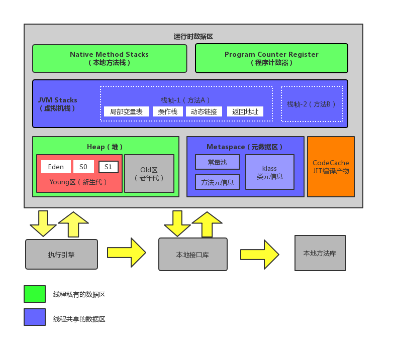
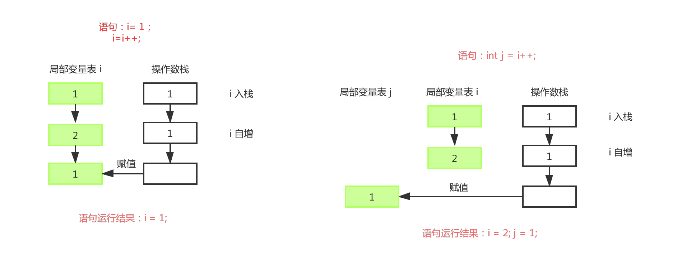

## 1、运行时数据区域

Java虚拟机所管理的内存包含以下几个运行时数据区域

1. 程序计数器
2. java虚拟机栈
3. java本地方法栈
4. 方法区
5. java堆
6. 运行时常量池
7. 直接内存



### 1.1、程序计数器

​	程序计数器（Program Counter Register）是一块较小的内存空间，可以看作是当前线程所执行的字节码的**行号指示器**。在虚拟机的概念模型里，字节码解释器工作时就是通过改变这个计数器的值来选取下一条需要执行的字节码指令，流程控制（分支、循环、跳转、异常处理 、线程恢复等基础功能）的实现也需要依赖这个计数器来完成。

**Java虚拟机的多线程是通过线程轮流切换并分配处理器执行时间的方式来实现的**。为了线程切换后能恢复到正确的执行位置，每个线程都需要有一个独立的程序计数器，各线程之间互不影响，独立存储，我们称这类内存区域为“线程私有”的内存。

对于正在执行的Java方法，程序计数器记录的是正在执行的虚拟机字节码指令的地址，若是native方法，则值为空（Undefined）。

**此内存区域是唯一一个在Java虚拟机规范中没有规定任何OutOfMemory情况的区域**

### 1.2、Java虚拟机栈

​	Java虚拟机栈（Java Virtual Machine Stacks）也是线程私有的，生命周期与线程相同。虚拟机栈描述的是 Java 方法执行的内存模型：每个方法在执行的同时都会**创建一个栈帧**（Stack Frame）用于**存储局部变量表、操作数栈、动态链接、方法出口**等信息。每一个方法的调用到执行完成的过程，就对应着一个栈帧在虚拟机栈中的入栈与出栈的过程。

​	两种异常状况：

- **StackOverflowError**：如果线程请求的栈深度大于虚拟机所允许的深度，抛出此异常
- **OutOfMemoryError**：如果虚拟机栈可以动态扩展，如果扩展时无法申请到足够的内存，抛出此异常。

#### 1.2.1、局部变量表

​	局部变量表存放了编译期可知的**各种基本数据类型**（byte、short、int、long、char、boolean、float、double）、**对象引用**（可能是指向对象起始地址的引用指针，也可能是指向一个代表对象的句柄或其他与此对象相关的位置）和**returnAddress类型**（指向了一条字节码指令的地址）。

​	64位长度的long和double类型的数据会占用2个局部变量空间（Slot），其余的数据类型只占用1个。

​	局部变量表所需的内存空间在编译期间完成分配，当进入一个方法时，这个方法需要在帧中分配多大的局部变量空间是完全确定的，在方法运行期间不会改变局部变量表的大小。

#### 1.2.2、操作栈

操作栈是一个初始状态为空的栈。在方法执行过程中，会有各种指令往栈中写入和提取信息。操作栈是与局部变量表交互的。看下面一段简单的例子

```java
int i = 1;
i = i++;   // i = 1
int j = i++;  // j = 1
```



#### 1.2.3、动态连接

每个栈帧中包含一个在常量池中对当前方法的引用，目的是支持方法调用过程的动态连接。

#### 1.2.4、方法返回地址

### 1.3、本地方法栈

​	本地方法栈（Native Method Stack）与虚拟机栈的作用非常相似，区别不过是虚拟机栈为虚拟机执行Java方法（也就是字节码）服务，而本地方法栈则为虚拟机使用到的Native方法服务。Sun HotSpot 虚拟机直接把本地方法栈和虚拟机栈合二为一。

​	与虚拟机栈一样，本地方法栈区域也有抛出StackOverflowError和 OutOfMemoryError 异常。

### 1.4、Java堆

Java 堆（Java Heap）是被所有**线程共享**的一块区域，在虚拟机启动时创建，用于**存放对象实例**，几乎所有的对象实例都在这里分配内存。

Java堆是`OOM`故障的主要发源地，也是垃圾收集器管理的主要区域。

堆的内存空间既可以固定大小，也可以在运行时动态地调整，通过如下参数设置初始值和最大值

`-Xms256M -Xmx1024M`，其中，-X 表示它是 JVM 运行参数，ms 即 memory start ，mx 即 memory max，分别代表最小堆容量和最大堆容量。通过这种方式我们可以给堆空间设置不同的容量，但是在线上生产环境中，堆空间不断地扩容与缩小，会给服务器带来一定的压力。所以我们一般将 Xms 和 Xmx 的值设置成一样大小，避免在 GC 调整堆大小时带来额外的压力。

#### 1.4.1、堆的划分

从内容回收的角度来看，Java堆可以分为：新生代和老年代；新生代又被划分为：Eden空间、From Survivor 空间、To Survivor空间等。

从内存分配的角度来看，线程共享的Java堆中可能划分出多个线程私有的**分配缓冲区（Thread Local Allocation Buffer,TLAB）**。进一步划分是为了更好地回收内存或更快的分配内存。

堆分配的空间在**逻辑地址上是连续的**，但在**物理地址上是不连续的**（采用了页式内存管理），如果逻辑地址空间上已经没有一段连续且足够大的空间，则分配内存失败。

### 1.5、方法区（x）元空间（√）

方法区（Method Area）与Java堆一样，是各个线程共享的内存区域，用于存储**已被虚拟机加载的类信息、常量、静态变量、即时编译器编译后的代码**等数据。虽然Java虚拟机规范把方法区描述为堆得一个逻辑部分，但是它却又一个别名叫做Non-Heap，目的应该是与Java堆区份开来。

#### 1.5.1、方法区与永久代

很多人把 HotSpot 虚拟机中的方法区称为永久代（Permanent Generation），本质上两者并不等价。

《Java 虚拟机规范》中规定了方法区的概念与作用，但并没有规定如何去实现它，而永久代就是方法区的一种实现。仅HotSpot虚拟机设计团队用永久代来实现方法区，这样垃圾收集器就可以像管理Java堆一样来管理这部分内存了。但这并不是一个好主意，因为这样更容易遇到内存溢出的问题。简单来说，**方法区是一个标准，永久代是一种实现**。

#### 1.5.2、常用参数

JDK1.8之前，可以通过下面这些参数来调节方法区大小

```shell
-XX:PermSize=N  #方法区 (永久代) 初始大小
-XX:MaxPermSize=N #方法区 (永久代) 最大大小,超过这个值将会抛出 OutOfMemoryError 异常:java.lang.OutOfMemoryError: PermGen
```

相对而言，垃圾收集行为在这个区域是比较少出现的，但并非数据进入方法区后就“永久存在”了。

在 JDK1.8 及以上版本中，设定 `MaxPermSize` 参数，JVM 在启动时不会报错，但是会提示：

`Java HotSpot 64Bit Server VM warning: ignoring option MaxPermSize=2560m;support was removed in 8.0`

在JDK 1.8 之后，方法区就被彻底移除了。取而代之的是元空间（Metaspace）区别于方法区，元空间在本地内存中分配，使用的是直接内存。在 JDK1.8 中，将方法区中所有的**字符串常量移到堆内存**，其他内容包括**类元信息、字段、静态属性、方法、常量等都移到元空间中。**

下面是一些关于元空间的常用参数

```shell
-XX:MetaspaceSize=N  #设置元空间的初始大小
-XX:MaxMetaspaceSize=N #设置元空间的最大大小
```

与永久代不同的是，如果不指定大小的话，随着更多类的创建，虚拟机会耗尽所有可用的系统内存。

**思考：为什么要永久代（PermGen）替换为元空间？**

永久代在启动时固定大小，很难进行调优，并且在 Full GC 时会移动类元信息，很容易导致内存溢出，此外，永久代在垃圾回收过程中还存在许多问题。而元空间使用的是本地内存，默认元空间大小是 `unlimited`，这意味着它只受系统内存的限制。所以，JDK 1.8 使用元空间替换永久代。

### 1.6、运行时常量池

**JDK1.7及之后版本的JVM已经将运行时常量池（Runtime Constant Pool）从方法区中移出，在Java堆中开辟了一块区域存放运行时常量池**

Class 文件中除了有类的版本、字段、方法、接口等描述信息外，还有一项信息是常量池（Constant Pool Table），用于存放编译器生成的**各种字面量**和**符号引用**，这部分内容将在类加载后进入方法区的运行时常量池中存放。

对于运行时常量池，一般来说，除了保存Class文件中描述的符号引用外，还会把翻译出来的**直接引用**也存储在运行时常量池中。

运行时常量池对于Class文件常量池的另外一个重要特征就是**具备动态性**，可以在运行期间将新的常量放入池中，这种特性被开发人员利用得比较多的便是String 类的`intern()` 方法。

**运行时常量池与class常量池的区别：**

- class常量池存在于静态的存储文件，主要包含字面量和符号引用。

- 运行时常量池存在于内存中，也就是常量池被加载到内存之后的版本，具备动态性

  

```java
		String str1 = new StringBuilder("计算机").append("软件").toString();
		//在JDK1.6中，intern方法会把首次遇到的字符串实例复制到永久代中，返回的是永久代中这个字符串实例的引		用，而StringBuilder创建的字符串在Java堆上，故返回false
		System.out.println(str1.intern() == str1);  // jdk1.7及以上的intern不会复制实例，只是在常量池中		 记录首次出现的实例引用。返回true  
		
		String str2 = new StringBuilder("ja").append("va").toString();
		
		System.out.println(str2.intern() == str2);  //false
	}
```


​	既然运行时常量池是方法区的一部分，自然受到方法区内存的限制，当常量池无法再申请到内存时会抛出OOM异常。


### 1.7、直接内存

​	直接内存（Direct Memory）并不是虚拟机运行时数据区的一部分，也不是Java虚拟机规范中定义的内存区域。但是这部分内存也被频繁地使用，而且也可能导致OOM异常。

​	**直接内存是JVM进程的Java堆外申请的内存，是用户空间的。**

​	在JDK1.4中新加入了NIO（New Input/OutPut）类，引入了一种基于通道（Channel）与缓冲区（Buffer）的I/O方式，它可以使用Native函数库直接分配堆外内存（直接内存），然后通过一个存储在Java**堆中的DirectByteBuffer对象作为这块内存的引用进行操作**。这样能在一些场景中显著提高性能，因为避免了再Java堆和Native堆中来回复制数据。

--为什么在执行网络IO或者文件IO时，一定要通过堆外内存呢？

答：我们把一个地址通过JNI传递给底层的C库时，有一个基本的要求就是这个地址上的内容不能失效。在堆中，Java进行GC管理时对象会进行移动，从而导致地址失效，所以必须要通过堆外内存，在GC管理不到的地方。

### 参考

1. [JavaGuide:Java内存区域](https://github.com/Snailclimb/JavaGuide/blob/master/docs/java/jvm/Java内存区域.md)
2. 《码出高效Java开发手册》
3. 《深入理解 Java 虚拟机：JVM 高级特性与最佳实践（第二版）》


