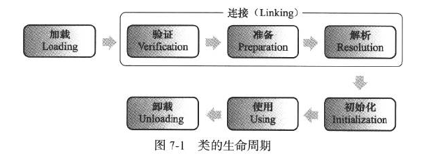

## 1、类加载机制

### 1.1、概述

虚拟机把描述类的**数据从 Class 文件加载到内存（加载）**，并**对数据进行校验、转换解析（连接**）和**初始化**，将其放在运行时数据区的方法区内，然后在内存中创建一个 `java.lang.Class`对象（规范并未说明 Class 对象位于哪里，HotSpot 虚拟机将其放在**方法区**中）用来封装在方法区的数据结构，这就是虚拟机的类加载机制。

在 Java 代码中，**类的加载、连接和初始化过程都是<font color="red">程序运行期间</font>完成的**，提供了更大的灵活性与可能性。

### 1.2、类加载的时机

类从被加载到虚拟机内存中开始，到卸载出内存为止，它的整个生命周期包括：加载（Loading）、验证（Verification）、准备（Preparation）、解析（Resolution）、初始化（Initialization）、使用（Using）和卸载（Unloading）7 个阶段。其中验证、准备、解析 3 个部分统称为连接（Linking）。



加载、验证、准备、初始化和卸载这 5 个阶段的顺序是确定的，类的加载过程必须按照这种顺序按部就班地开始，但是要注意，这些阶段通常都是互相交叉地混合式进行的，通常会在一个阶段执行的过程中调用、激活另外一个阶段。

而解析阶段则不一定：它在某些情况下可以在初始化阶段之后再开始，这是为了支持 Java 语言的运行时绑定（也称为动态绑定）。

对于什么时候进行了类加载，Java 虚拟机规范并没有进行强制约束。但是对于初始化阶段，虚拟机规范有着严格的规定，必须有且仅有 **5 种情况必须立即对类进行初始化**：

1. 遇到 `new` 、`getstatic`、`putstatic` 或 `invokestatic` 这 4 条字节码指令时，如果类没有进行过初始化，则需要先触发其初始过。字节码指令常见代码场景：
   - `new`：使用 `new`关键字实例化对象
   - `getstatic`：访问某个类的静态变量（**被 `final` 修饰，已在编译期把结果放入常量池的静态字段除外，即静态常量除外）**
   - `putstatic`：对某个静态变量进行赋值
   - `invokestatic`：调用类的静态方法
2. 反射（`Class.forName(“com.test.Test”)`)；
3. 初始化一个类的子类，会先初始化它的父类
4. 当虚拟机启动时，用户需要指定一个要执行的主类（包含 `main()` 方法的那个类），虚拟机会先初始化这个主类。
5. 当使用 JDK1.7 的动态语言支持时，如果一个 `java.lang.invoke.MethodHadnle`实例最后的解析结果 REF_getStatic、REF_putStatic、REF_invokeStatic 的方法句柄，并且这个方法句柄所对应的类没有进行过初始化，则需要先触发其初始化。

#### 1.2.1、代码示例

- 测试代码1：

```java

/**
 *
 * 对于静态字段来说，只有直接定义了该字段的类才会被初始化
 * 当一个类在初始化时，要求父类全部都已经初始化完毕
 * -XX:+TraceClassLoading 用于追踪类的加载信息并打印出来
 * -XX: +<option> 表示开启option选项
 * -XX: -<option> 表示关闭option选项
 * -XX:<option>=value 表示将option的值设置为value
 * 
 */
public class MyTest1 {
    public static void main(String[] args) { 
        //i am parent1
        //i am child1
        //hello world
        //System.out.println(MyChild1.childStr);  
        
        //i am parent1
        //hello world
        System.out.println(MyChild1.parentStr);  
    }
}
class MyChild1 extends MyParent1{
    public static String childStr = "myChild1";   
    static {
        System.out.println("i am child1");
    }

}
class MyParent1 {
    public static String parentStr = "hello world";
    static {
        System.out.println("i am parent1");
    }
}
```

- 测试代码2：

```java
/**
 *
 *   编译时可以确定的常量在编译阶段会存入到调用这个常量所在类（MyTest2）的常量池中
 *   如果是运行时才可以确定的常量，则相当于对静态字段的调用，需要初始化常量所在的类（MyParent2）
 *   本质上，调用类（MyTest2）并没有直接调用到定义常量的类（MyParent2），因此不会触发定义常量所在类（MyParent2）的初始化
 *   注意：编译时已经将常量存到MyTest2的常量池，之后MyTest2和MyParent2就没有任何关系了
 *   甚至我们可以将MyParent2的class文件删除，程序还可以正常运行
 *
 *
 *   助记符 ldc：表示将int、float或者String类型的常量值从常量池中推送至栈顶
 *   助记符 bipush：表示将单字节（-128-127）的常量值推送至栈顶
 *   助记符 sipush：表示将一个短整型值（-32768-32769）推送至栈顶
 *   助记符 iconst_1：表示将int型的1推送至栈顶（iconst_m1 - iconst5)
 *
 */
public class MyTest2 {
    public static void main(String[] args) {
        //hello world
        System.out.println(MyParent2.str);
        System.out.println(MyParent2.s);
        System.out.println(MyParent2.i);
        System.out.println(MyParent2.j);
    }
}

class MyParent2 {
    //public static final String str = "hello world";               //编译时确定
    public static final String str = UUID.randomUUID().toString();  //运行时才能确定
    public static final short s = 7;
    public static final int i = 129;
    public static final int j = 1;
    static {
        System.out.println("i am MyParent2");
    }
}
```

- 测试代码3：

```java
/**
 *
 *   对于数组实例来说，其类型是由JVM在运行期动态生成的，表示为[Lcom.bettercsw.classLoader.MyParent3 这种形式
 *   对于数组来说，JavaDoc 经构成数据的元素成为Component，实际上是将数组降低一个维度后的类型
 *   
 *   助记符：anewarray:表示创建一个引用类型（如类、接口）的数组，并将其引用值压入栈顶
 *   助记符：newarray：表示创建一个指定原始类型（int boolean float double）的数组，并将其引用值压入栈顶
 *
 */
public class MyTest3 {
    public static void main(String[] args) {
        //创建类的实例，属于主动使用，会导致类的初始化
        MyParent3 myParent3 = new MyParent3();
        MyParent3[] myParent3s = new MyParent3[1];
        //class [Lcom.bettercsw.classLoader.MyParent3;
        System.out.println(myParent3s.getClass());
        //class java.lang.Object
        System.out.println(myParent3s.getClass().getSuperclass());

        int[] i = new int[1];
        //class [I
        System.out.println(i.getClass());
        //class java.lang.Object
        System.out.println(i.getClass().getSuperclass());
    }
}

class MyParent3 {
    static {
        System.out.println("i am parent");
    }
}
```

- 测试代码4：

```java
/**
 *
 *   在初始化一个类时，并不会先初始化它所实现的接口
 *   在初始化一个接口时，并不会先初始化它的父接口
 *   因此，一个父接口并不会因为它的子接口或者实现类的初始化而初始化。只有当程序首次使用特定接口的静态变量（如调用父类接口中运行时才能确定的常量，编译时就能确定常量不会进行初始化）时，才会导致该接口的初始化
 *   即使父接口初始化了，子接口也不一定进行初始化
 *
 */
public class MyTest4 {
    public static void main(String[] args) {
       //MyChild4、MyParent4都不会初始化，不会进行加载
       System.out.println(MyChild4.b);
        
       //MyChild4、MyParent4都不会初始化，不会进行加载
       // System.out.println(MyChild4.a);
        
       //MyParent4会初始化，MyChild4不会初始化，但会进行加载
       // System.out.println(MyChild4.thread);
        
       //MyChild4会进行初始化，MyParent4不会初始化，但会进行加载
       System.out.println(MyChild4.c);
        
        
    }
}

interface MyParent4 {   //接口字段默认都是 public static final
    
    int a = 5;

    Thread thread = new Thread(){
        {
            System.out.println("parent4 invoked");
        }
    };
    //若有初始化，则会报错,加载不会报错
    //int i = 1/0;
}

interface MyChild4 extends MyParent4 {
    int b = 6;
    int c = new Random().nextInt(3);
    //若有初始化，则会报错，加载不会报错
      int i = 1/0;
}
```

### 1.3、类加载的过程

#### 1.3.1、加载

加载是类加载（Class Loading）过程的一个阶段，我们要注意区别，不要混淆。

在加载阶段，虚拟机需要完成以下 3 件事情：

1. 通过一个类的全限定名来获取定义此类的二进制字节流
2. 将这个字节流所代表的静态存储结构转化为方法区的运行时数据结构
3. 在内存中生成一个代表这个类的 java.lang.Class 对象，作为方法区这个类的各种数据的访问入口

加载 `.class`文件的方式：

1. 从本地系统中直接加载
2. 通过网络下载 `.class` 文件
3. 从 zip，jar 等归档文件中加载 `.class` 文件
4. 从专用数据库中提取 `.class` 文件
5. 将 java 源文件动态编译为 `.class` 文件

相对于类加载过程的其他阶段，一个**非数组类**的加载阶段（准确地说，是加载阶段中获取类的二进制字节流的动作）是开发人员可控性最强的，因为加载阶段既可以使用系统提供的引导类加载器来完成，也可以由用户自定义的类加载器去完成，开发人员可以通过定义自己的类加载器去控制字节流的获取方式（即重写一个类加载器的 `loadClass() `方法）

对于数组类而言，情况有所不同，**数组类本身不通过类加载器创建**，它是由 Java 虚拟机直接创建的。不过，**数组类的元素类型（Element Type，指的是数组去掉所有维度的类型）最终是要靠类加载器去创建**，一个数组类（以下简称为 C）创建过程就遵循以下规则：

- 如果数组的组件类型（Component Type，指的是数组去掉一个维度的类型）不是引用类型（如 int[ ] 数组），Java 虚拟机将会把数组 C 标记为与引导类加载器关联
- 如果数组的组件类型是引用类型，那就递归地去加载这个组件类型，数组 C 将在**加载该组件类型的类加载器的类名称空间上被标识（一个类必须与类加载器一起确定唯一性）**
- 数组类的可见性与它的组件类型的可见性一致，如果组件类型不是引用类型，那数组类的可见性将默认为 public

加载阶段完成后，虚拟机外部的二进制字节流就按照虚拟机所需的格式存储在方法区之中，方法区中的数据存储格式由虚拟机实现自行定义，虚拟机规范未规定此区域的具体数据结构。然后再内存中实例化一个`java.lang.Class` 类的对象（并没有明确规定是在 Java 堆中，对于 HotSpot 虚拟机而言，Class 对象比较特殊，它虽然是对象，但是存放在方法区里面），这个对象作为程序访问方法区中的这些类型数据的外部接口。

加载阶段与连接阶段的部分内容（如一部分字节码文件格式验证动作）是交叉进行的，加载阶段尚未完成，连接阶段可能已经开始，但必然是加载阶段先开始进行的。

#### 1.3.2、验证

#### 1.3.3、准备

#### 1.3.4、解析

#### 1.3.5、初始化


### 1.4、类加载器

## 参考资料

《深入理解Java虚拟机：JVM高级特性与最佳实践 第二版 周志明》