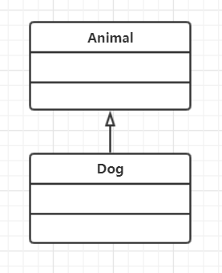
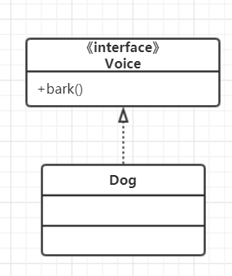
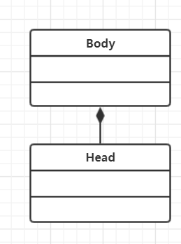
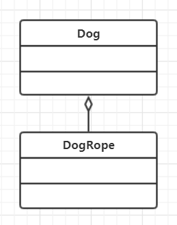
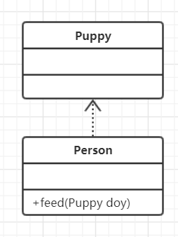
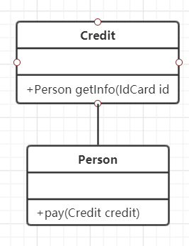
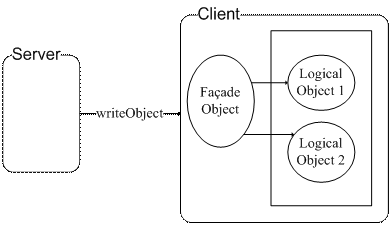

[TOC]

## 1、抽象类与接口

### 1.1、抽象类

抽象类和抽象方法都使用`abstract`关键字进行声明。如果一个类中包含抽象方法，那么这个类必须声明为抽象类，子类必须实现抽象类的抽象方法

抽象类和普通类最大的区别就是，**抽象类不能被实例化，但是可以通过匿名内部类来访问**。

我们可以这样理解：匿名内部类实现了抽象类的抽象方法并且返回了一个内部对象，抽象类的引用指向了这个内部对象。

```java
public abstract class AbstractClassTest{
    protected int x;
    private int y;
    public void test1(){
        System.out.println("test1");
    }
    public abstract void test2();   //抽象方法不能声明为private,否则不能被子类实现
}
```

```java
public class AbstractClassImpl extends AbstractClassTest{
    @Override
    public void test2() {
        System.out.println("test2");
    }

    public static void main(String[] args) {
        //匿名内部类AbstractClassImpl$1.class，不是对AbstractClassTest抽象类进行实例化
        AbstractClassTest classTest = new AbstractClassTest() {
            @Override
            public void test2() {
                System.out.println("test2");
            }
        };
        AbstractClassTest abstractClassTest = new AbstractClassImpl();
        classTest.test2();
        abstractClassTest.test2();
    }
}
```

### 1.2、接口

接口是抽象类的延伸，在 Java8 之前，它可以看成是完全抽象的类，也就是说它不能有任何实现方法。

从 Java8 开始，接口可以有静态方法和默认实现方法。这是因为不支持默认实现方法的接口维护成本太高了，如果我们为一个接口新增了一个方法，那么所有实现该接口的类都需要进行修改，十分麻烦。

接口的成员（字段 + 方法）默认都是 `public`的，并且不允许定义为`private`和 `protected`

接口的字段默认都是 `static` 和`final`的

### 1.3、接口与抽象类的比较

- 从设计层面来说，抽象类提供了一种 IS-A 关系，那么就必须满足里氏替换原则，即子类对象必须能够替换掉所有父类对象。而接口更像是一种 LIKE-A 关系，它只是提供一种方法实现契约，并不要求接口和其实现类具有 IS-A 关系。简单来说，抽象类是对类的抽象，接口是对行为的规范。
- 从使用层面来看，一个类可以实现多个接口，但是不能继承多个抽象类。
- 接口的字段必须是 `static` 和 `final` 类型的，抽象类的字段没有这种限制
- 接口的成员必须是 `public` 的，抽象类的成员可以用多种访问权限。
- 接口不能定义构造方法

## 2、访问控制符

|            | private |  无  | protected | public |
| ---------- | :-----: | :--: | :-------: | :----: |
| 同一类中   |    √    |  √   |     √     |   √    |
| 同一包中   |    ×    |  √   |     √     |   √    |
| 子类       |    ×    |  ×   |     √     |   √    |
| 全局范围内 |    ×    |  ×   |     ×     |   √    |

## 3、类关系

| 类关系                 | 描述                                  | 权力强侧 | 类图示例                                                     | 示例说明                                                     |
| ---------------------- | ------------------------------------- | -------- | ------------------------------------------------------------ | ------------------------------------------------------------ |
| 继承（Generalization） | 父类与子类之间的关系：is-a            | 父类方   |  | 小狗继承于动物，完全符合里氏代换原则                         |
| 实现（Realization）    | 接口与实现类之间的关系：can-do        | 接口方   |  | 小狗实现了狗叫的接口行为                                     |
| 组合（Composition）    | 比聚合更强的关系：contains-a          | 整体方   |  | 头只能是身体强组合的一部分，两者完全不可分，具有相同的生命周期 |
| 聚合（Aggregation）    | 暂时组装的关系：has-a                 | 组装方   |  | 小狗和狗绳之间是暂时聚合关系，狗绳完全可以复用在另一条狗上   |
| 依赖（Dependency）     | 一个类用到另一个类：depends-a         | 被依赖方 |  | 人喂养狗，小狗作为参数传入，是一个依赖关系                   |
| 关系（Association）    | 类与类之间存在互相平等的关系：links-a | 平等     |  | 人可以用信用卡消费，由信用卡可以提取到人的信息               |

## 4、序列化

### 4.1、序列化（Serialization）与反序列化（Deserialization）

内存中的数据对象只有转换为二进制流才可以进行数据持久化和网络传输。

**序列化**就是将数据对象转换为二进制流（字节系列）的过程。反之，将二进制流（字节系列）转换为数据对象的过程称之为反**序列化**。

序列化需要保留充分的信息以恢复数据对象，但是为了节约存储空间和网络带宽，序列化后的二进制流又要尽可能小。

序列化常见的使用场景是 RPC 框架的数据传输。

### 4.2、常见的序列化方式

#### 4.2.1、Java 原生序列化

- 序列化：`ObjectOutputStream.writeObject()`
- 反序列化：`ObjectOutputStream.readObject()`

Java 类通过实现 `Serializble` 接口来实现类对象的序列化，这个接口很特殊，没有任何方法，只起到标识的作用。若没有实现该接口而去进行序列化，会抛出`java.io.NotSerializableException`异常。

**serialVersionUID 的作用**

虚拟机是否允许反序列化，不仅取决于类路径和功能代码是否一致，还要看`serialVersionUID `是否一致。若两个类的功能代码完全一致，但`serialVersionUID `不同，他们就无法相互序列化和反序列化



​																			门面模式结构图

门面（Facade）模式为应用程序提供统一的访问接口。图中 Client 端通过 Facade Object 才可以与业务逻辑对象进行交互。而 Facade Object 不能直接由 Client 生成，而是需要 Server 端生成，然后序列化后通过网络将二进制对象数据传给 Client，再由 Client 端反序列化得到 Facade Object 对象。

该模式可以使得 Client 端程序的使用需要 Server 端的许可，同时 Client 端和 Server 端的 Facade Object 类需要保持一致。

当服务器端想要进行版本更新时，只要将服务器端的 Façade Object 类的`serialVersionUID `再次生成，Client 端反序列化 Façade Object 就会失败，也就是强制 Client 端从服务器端获取最新程序。

实现 了 `Serializble` 接口的类建议设置 `serialVersionUID`，如果不设置，那么每次运行时，编译器会根据类的内部实现，包括类名、接口名、方法和属性等自动生产`serialVersionUID`。如果类的源代码有修改，那么重新编译后 `serialVersionUID`的值可能发生变化。修改类时需要根据兼容性决定是否修改`serialVersionUID`值：

- 如果是兼容升级，请不要修改`serialVersionUID`字段，避免反序列化失败
- 如果是不兼容升级，需要修改`serialVersionUID`字段，避免反序列化混乱

**父类序列化与 `transient `关键字**

若子类实现了 `Serializble` 接口，但父类没有实现，依然可以对该类进行序列化，不过有以下几点需要注意的：

- 父类没有实现`Serializble` 接口，父类对象不会被序列化
- Java 对象的构造必须先实例化父类对象，才有子类对象。在反序列化时，为了构造父类对象，程序会调用父类的**无参构造函数**作为默认的父类对象。若父类的变量没有在无参构造函数进行初始化，则都是默认声明的值，如 int 类型是0，String 类型是 null

`transient` 关键字可以使一些属性不会被序列化。

> ArrayList 中存储数据的数组 elementData 是用 transient 修饰的，因为这个数组是动态扩展的，并不是所有的空间都被使用，因此就不需要所有的内容都被序列化。通过重写序列化和反序列化方法，使得可以只序列化数组中有内容的那部分数据。

**序列化存储规则**

Java 序列化机制为了节省磁盘空间，具有特定的存储规则，当写入文件的为同一对象时，并不会再将对象的内容进行存储，而只是再次存储一份引用。反序列化时，恢复引用关系。该存储规则极大的节省了存储空间

简单的序列化与反序列化代码如下：

```java
public static void main(String[] args) throws IOException, ClassNotFoundException{

        Test a1 = new Test(123, "abc");
        String objectFile = "test";
	    //序列化
        ObjectOutputStream oos = new ObjectOutputStream(new FileOutputStream(objectFile));
        oos.writeObject(a1);
        oos.flush();
        System.out.println(new File(objectFile).length());
        oos.writeObject(a1);
        oos.close();
        System.out.println(new File(objectFile).length());

		//反序列化
        ObjectInputStream ois = new ObjectInputStream(new FileInputStream(objectFile));
        Test a2 = (Test) ois.readObject();
        Test a3 = (Test) ois.readObject();
        ois.close();
        System.out.println(a2 == a3);    //true
    }

    private static class Test implements Serializable {

        private int x;
        private String y;

        Test(int x, String y) {
            this.x = x;
            this.y = y;
        }

        @Override
        public String toString() {
            return "x = " + x + "  " + "y = " + y;
        }
    }
}
```

**注意：**数据对象序列化到指定文件后，我们直接打开文件进行查看可能是乱码的，这是因为数据对象已经被转化为二进制流，文本编辑器无法识别，**与编码字符集无关**。只有通过反序列化将存储的二进制流读取出来，才能正常显示在控制台上。<font color="yellow">此外，序列化只是保存对象的状态，静态变量是属性类的状态，故不会对静态变量进行序列化</font>

#### 4.2.2、Hessian 序列化

Hessian 序列化是一种支持动态类型、跨语言、基于对象传输的网络协议。简单来说，Hessian 是一个轻量级的 RPC 框架。

Hessian 协议具有如下特性：

- 自描述序列化类型。不依赖外部描述文件或接口定义，用一个字节表示常用基础类型，极大缩短二进制流
- 语言无关，支持脚本语言
- 协议简单，比 Java 原生序列化高效

Hessian 会把复杂对象所有属性存储在 Map 中进行序列化。所以在父类、子类存在同名成员变量的情况下， Hessian 序列化时，先序列化子类，再序列化父类，因此反序列化结果会导致子类同名成员变量被父类的值覆盖

#### 4.2.3、JSON 序列化

JSON 是一种轻量级的数据交换格式。JSON 序列化就是将数据对象转换为 JSON 字符串。在序列化过程中抛弃了类型信息，所以反序列化时只有提供类型信息才能准确地反序列化。相比前两种方式，JSON 可读性好，方便调试。

## 5、重写（Override）与重载（Overload）

### 5.1、重写

`Override`有不同的翻译版本，重写、覆盖、覆写，感觉还是重写用的比较多，故这里就采用重写这个翻译了。

`Override`存在于继承体系中，指子类实现了一个与父类在方法声明上完全相同的一个方法，是多态的动态实现。

重写父类方法时，有以下三个限制

1. 子类方法的访问权限必须大于等于父类方法
   - 若父类为`protected`，子类必须是`protected`或`public`
2. 子类方法的返回类型必须是父类方法返回类型或是其子类型
   - 必须是严格的继承关系，如父类的返回类型为`int`，子类不能为`Integer`，`int`和`integer`不存在继承关系
   - **在重写时，父类方法指向了子类方法的实现，编译器会检查返回值是否向上兼容**
3. 子类方法跑出的异常类型必须是父类抛出异常类型或是其子类型
   - 父类抛出`SQLException`，子类必须抛出该异常或其子类

重写采用 `@Override`注解，编译器会自动检查以上限制。

```java
public class Father {
    protected Number doSomething(int a,Integer b,Object c) throws SQLException {
        System.out.println("Father's doSomething");
        return 7777777;
    }
}
```

```java
public class Son extends Father{
    @Override
    public Integer doSomething(int a,Integer b,Object c) throws SQLClientInfoException {
        System.out.println("Son's doSomething");
        return 777;
    }
}
```

### 5.2、重载

在同一个类中，如果多个方法有相同的名字、不同的参数，即称为重载。

在编译器眼里，**方法名称+参数类型+参数个数**，组成一个唯一键，称为方法签名。JVM 通过方法签名来决定调用哪个重载方法。访问控制符、返回类型、标识符都不属于方法签名，故无法识别。

让我们来看看下面代码，如果调用`methodForOverload(7)`，JVM 会调用哪个方法呢？

```java
public class OverloadMethods {
    public void OverloadMethod(){
        System.out.println("无参方法");
    }
    public void methodForOverload(int param){
        System.out.println("参数为基本数据类型int的方法");
    }
    public void methodForOverload(long param){
        System.out.println("参数为基本数据类型long的方法");
    }
    public void methodForOverload(Integer param){
        System.out.println("参数为包装类型integer的方法");
    }
    public void methodForOverload(Object param){
        System.out.println("可变参数方法");
    }
    public void methodForOverload(Integer... param){
        System.out.println("可变参数方法");
    }
}
```

JVM 重载方法中，选择合适的目标方法的顺序如下：

1. **精确匹配**
   - 调用`methodForOverload(int param)`
2. **如果是基本数据类型，自动转换成更大表示范围的基本类型**
   - 若没有`methodForOverload(int param)`，则调用`methodForOverload(long param)`
3. **通过自动拆箱与装箱**
   - 且没有`methodForOverload(long param)`，则调用`methodForOverload(Integer param)`
4. **通过子类向上转型继承路线依次匹配**
   - 且没有`methodForOverload(Integer param)`，则调用`methodForOverload(Obejct param)`
5. **通过可变参数匹配**
   - 且以上重载方法都没有，则调用`methodForOverload(Integer... param)`

可见，可变参数匹配的优先级是最低的。

- 重写是运行时多态，重载是编译时多态。

## 6、异常机制


## 7、泛型

泛型的本质是类型参数化，解决不确定具体对象类型的问题。

泛型可以定义在类、接口、方法中。在泛型定义时，约定俗成的符号有：

- E 代表 Element，用于集合中的元素
- T 代表 the Type of object，表示某个类
- K 代表 Key、V 代表 Value，用于键值对元素

一个示例彻底记住泛型定义的概念

```java
public class GenericDefinitionDemo<T> {
    static <String,T,Alibaba> String get(String str,Alibaba alibaba) {
        return str;
    }
    public static void mian(String[] args) {
        Integer first = 1;
        Long second = 2L;
        Integer result = get(first,second);
    }
}
```

上述代码是可以正常运行的。`get(String str,Alibaba alibaba)`是一个泛型方法，String 并非是 `java.lang.String`类型，而是泛型标识<String>,同理`Alibaba`也为泛型标识。`get()`中其他没有被用到的泛型符号并不会导致编译错误，类名后的<T> 与 <String,T,Alibaba> 内的 T 是可以相同的，但它们是两个指代，互不影响。当然，在实际应用中，并不会存在这样的定义方式，这里只是为了让我们对泛型有更好的理解。

**定义泛型时，要注意以下几点：**

1. 尖括号 < > 里的每个元素都指代一种未知类型
2. 尖括号 < >的位置非常讲究，必须在**类名之后**或**方法返回值**之前
3. 泛型在定义处只具备执行 Object方法的能力。
4. 泛型只是一种编译时的语法检查。对于编译之后的字节码指令，会执行强制类型转换，这就是**泛型擦除**。

### 7.1、泛型的使用

Java 引入泛型之前，表示可变类型时往往存在类型安全的风险。举一个生活中的例子，微波炉最重要的功能是加热食物，有可能用来加热肉或者汤。以下是没有引入泛型的写法：

```java
public class Stove {
    public static Object heat(Object food) {
        System.out.println(food + "is done");
        return food;
    }
    public static void main(String[] args) {
        Meat meat = new Meat();
        meat = (Meat)Stove.heat(meat);
        Soup soup = new Soup();
        soup = (Soup)Stove.heat(soup);
    }
}
```

为了避免给每种食材定义一个加热方法，如`heatMeat()、heatSoup()`等，将 `heat()`的参数和返回值定义为 Object，用“向上转型”的方式，让其具备加热任意类型食材的能力。这种方式增强了类的灵活性，但却会让客户端产生困惑，因为客户端对加热的内容一无所知，在取出来时进行强制转换就会存在类型转换风险。泛型则可以完美地解决这个问题。

引入泛型后的代码：

```java
public class Stove {
    public static <T> T heat (T food) {
        System.out.println(food + "is done");
        return food;
    }
      public static void main(String[] args) {
        Meat meat = new Meat();
        meat = Stove.heat(meat);
        Soup soup = new Soup();
        soup = Stove.heat(soup);
    }
}
```

通过使用泛型，既可以避免定义两种不同的方法，也可以避免使用 Object 作为输入和输出，带来强制转换的风险。只要这种强制转换的风险存在，依据墨菲定律，就一定会发生 `ClassCastException` 异常。特别是在复杂的代码逻辑中，会形成网状的逻辑关系，如果任意使用强制转换，无论可读性还是安全性都存在问题。

### 7.2、使用泛型的好处

1. 类型安全，不用担心抛出 `ClassCastException`
2. 提升代码可读性，从编码阶段就显式地知道泛型集合、泛型方法等处理的对象类型是什么
3. 代码重用，泛型合并了同类型的处理代码，使代码重用度变高

### 7.3、泛型与集合

## 8、反射

## 9、Java和C++的区别

- Java 是纯粹的面向对象语言，所有的对象都继承自 `java.lang.Object`，C++ 为了兼容 C ，既支持面向对象也支持面向过程
- Java 通过 JVM 实现跨平台特性，C++ 不能跨平台
- Java 没有指针，它的引用可以理解为安全指针，而 C++ 具有和 C 一样的指针
- Java 支持自动垃圾回收，C++ 需要手动回收
- Java 不支持多继承，但是可以通过实现多个接口来达到相同的目的，而 C++ 支持多继承
- Java 不支持重载操作符，虽然可以对两个 String 对象执行加法运算，但是这是语言内置支持的操作，不属于操作符重载，而 C++ 可以。
- Java 的 `goto` 是保留字，不可用。C++ 可以使用`goto`关键字
- Java 支持多线程，而 C++ 需要引入第三方库来实现多线程

## 10、Object 类的方法

## 11、fail-fast 机制

## 参考

-  《码出高效 Java开发手册》
- [CS-Notes](https://github.com/CyC2018/CS-Notes/blob/master/notes/Java 基础.md)

- [Java IO](https://github.com/CyC2018/CS-Notes/blob/master/notes/Java IO.md)

- [Java序列化的高级认识](https://www.ibm.com/developerworks/cn/java/j-lo-serial/index.html)