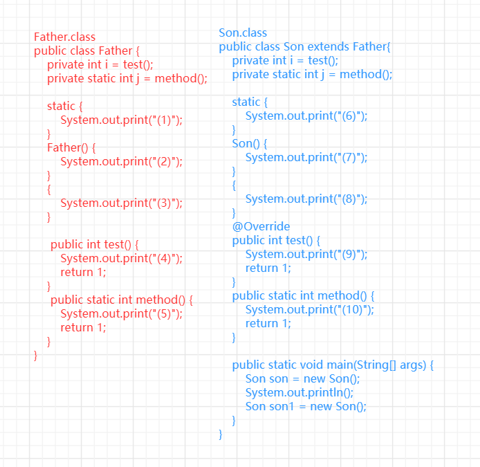

### 1、面试题

**考点：**

1. 类初始化过程
2. 实例初始化过程
3. 方法的重写

### 2、类初始化过程

1. 一个类要创建实例需要先加载并初始化该类
   - main 方法所在的类需要先加载和初始化
2. 一个子类要初始化需要先初始化父类
3. 类的初始化就是执行<cliinit>( ) 方法
   - <cliinit>( ) 方法由**静态类变量显示赋值代码和静态代码块**组成
   - 类变量显示赋值代码和静态代码块按顺序执行
   - <cliinit>( ) 方法只执行一次

### 3、实例初始化过程

1. 实例初始化就是执行<init>( ) 方法
   - <init>( ) 方法可能重载多个，有几个构造器就有几个<init>( ) 方法
   - <init>( ) 方法由**非静态实例变量显示赋值代码和非静态代码块、对应构造器代码**组成
   - 非静态实例显示赋值代码和非静态代码块代码按顺序执行，而对应**构造器的代码最后执行**
   - 每次创建实例对象，调用对应构造器，执行的就是对应的<init>( ) 方法
   - <init>( ) 方法的首行的 super( ) 或 super( 实参列表 )，即对应父类的 <init> 方法

### 4、方法的重写

1. 哪些方法不能被重写
   - final 方法
   - 静态方法
   - private 等子类中不可见的方法
2. 对象的多态性
   - 子类如果重写了父类的方法，通过子类对象调用的一定是子类重写过的代码
   - 非静态方法默认的调用对象是this
   - this 对象在构造器或者说 <init>( ) 方法中就是正在创建的对象

