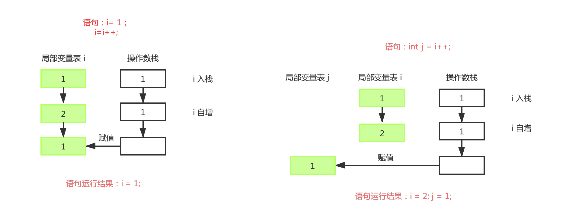
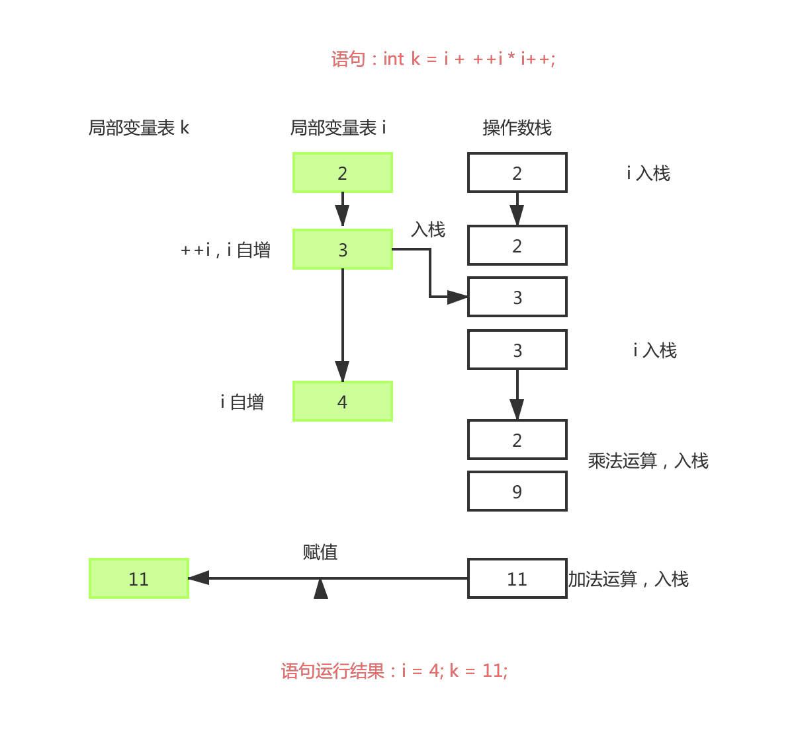

```java
public static void main(String[] args){
    int i = 1;
    i = i++;
    int j = i++;
    int k = i + ++i * i++;
    System.out.println("i=" + i);  
    System.out.println("j=" + j);  
    System.out.println("k=" + k);  
}
```

解析：

`i = i++；`该语句执行分为三步

①把 i 的值压入操作数栈

② i 变量自增

③把操作数栈中的值赋值给 i，i 的值还是为 1

`j = i++;`同理



`int k = i + ++i * i++;`语句执行步骤如下

① 把 i 的值压入操作数栈

② i 变量自增，然后压入操作数栈

③ 把 i 的值压入操作数栈

④ i 变量自增

⑤ 乘法运算，将结果压入操作数栈

⑥ 加法运算，将结果压入操作数栈

⑦ 将最终结果赋值给局部变量表 k， 即最终运行结果为 k = 11；



<font color="red">i++ 与 ++i 的区别：</font>

**i++ 是先将 i 的值压入操作数栈，再进行自增**

**++i 是先自增，再将自增的结果压入操作数栈**

考察知识点：该题主要考察 i++ 与 ++i 的区别以及对赋值运算的理解。

