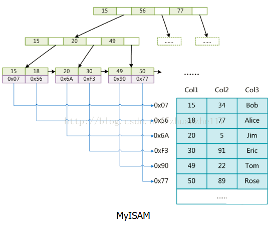
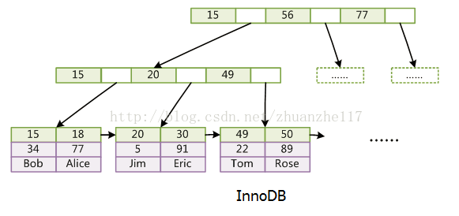
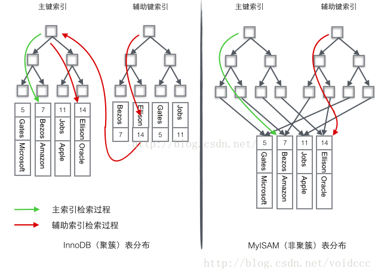

## 1、什么是索引？ 

索引是帮助MySQL高效获取数据的**数据结构**，数据本身之外，**数据库还维护着一种满足特定查找算法的数据结构**，这些数据结构以某种方式指向数据，这样就可以在这些数据结构的基础上实现高级查找算法，这种数据结构就是索引。

### 1.1、为什么要使用索引

- 通过创建唯一性索引，可以保护数据库表中每一行数据的唯一性
- 可以大大加快数据的检索速度，减少检索的数据量
- 帮助服务器避免排序和临时表
- 将随机IO变成顺序IO，降低数据库IO成本

### 1.2、索引有哪些缺点

- 索引实际上也是一张表，需要占用一定的物理空间，如果要建立聚簇索引，那么需要的空间就会更大
- 索引会降低表的更新速度，因为更新表时，数据库不仅要更新数据，还需要对索引表也进行更新。
- 创建索引和维护索引要耗费时间，这种时间随着数据量的增加而增加

## 2、MySQL索引主要使用的两种数据结构

### 2.1、哈希索引

对于哈希索引来讲，底层就是哈希表，因此在绝大多数需求为**单条记录查询**时，可以选择哈希索引，查询性能最快；其余大部分场景，我们都是使用BTree索引

### 2.2、BTree索引

MySQL的BTree索引使用的时B树中的B+Tree。对于MYISAM和InnoDB的实现方式不同

B树每个节点都存储key的data，所有节点组成这棵树，并且叶子节点指针为null

B+树只有叶子节点存储data，叶子节点包含了这棵树的所有键值，叶子节点不存储指针
.png)

后来，在**B+树上增加了顺序访问指针**，也就是**每个叶子节点增加一个指向相邻叶子节点的指针，这样一棵树成了数据库系统实现索引的首选数据结构。** 

**使用这种数据结构的原因：**

  原因有很多，最主要的是这棵树矮胖。一般来说，索引很大，往往以索引文件的形式存储的磁盘上，索引查找时产生磁盘I/O消耗，相对于内存存取，I/O存取的消耗要高几个数量级，所以评价一个数据结构作为索引的优劣最重要的指标就是在查找过程中磁盘I/O操作次数的时间复杂度。树高度越小，I/O次数越少。 

### 2.3、B+树的优点

- 内联节点没有数据，页内存可以存储更多的`key`，因此可以增加缓存命中率
- 叶子节点增加了顺序访问指针，当对索引进行全局扫描时效率较高。
- 相比B+树，B树因为每个节点都存有数据，我们可以把一些热点数据存放在离根节点更近的地方，加快访问速度。

### 2.4、MYISAM和InnoDB对索引的实现方式

- MYISAM  
data存放数据地址。索引是索引，数据是数据（非聚簇索引）
 
- InnoDB
data存放的是数据本身。索引也是数据。（聚簇索引） 

上图为主键索引，InnoDB 还维护着一张辅助索引，当where 条件不是按主键索引查询时，会先往辅助索引树里面找对应的主键索引，再到主建索引树里面查找。

