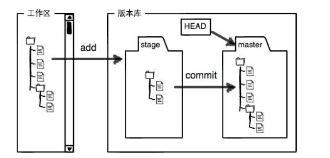
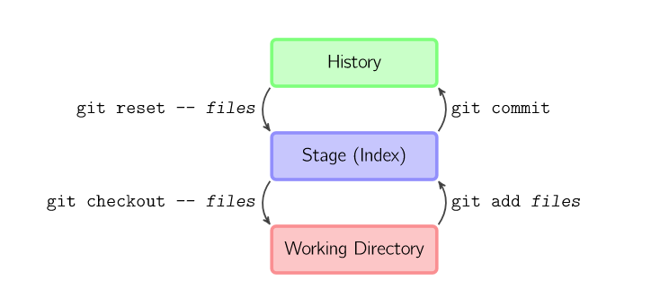
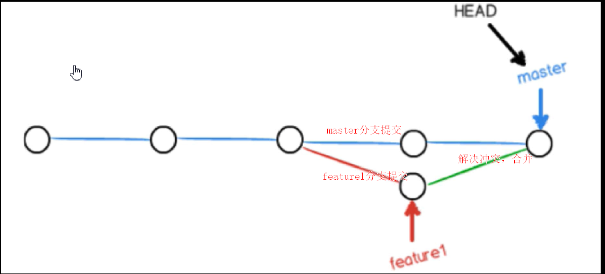
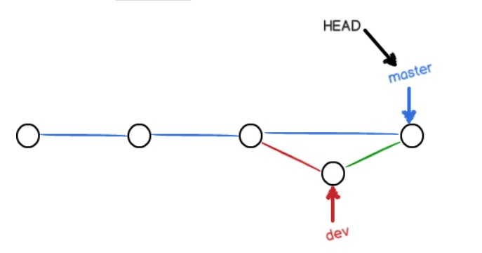

  

## 1、Git简介

git官网：[https://www.git-scm.com](https://www.git-scm.com/)

### 1.1、Git 简史


### 1.2、SVN 与 Git

- 集中式版本控制系统（CVCS）：SVN
  - 只有中心服务器存放代码
  - 有安全性问题，中心服务器挂了，所有人工作停止
  - 需要联网，提交文件的速度受网速影响
  - 建一个分支相当于复制一份完整代码。
- 分布式版本控制系统（DVCS）：Git
  - 每台电脑都有一份代码
  - 无需联网
  - 新建分支、合并分支操作速度非常快

传统SVN维护的是增量变化，Git维护的是全量变化。


### 1.3、Git、GitHub与GitLab

- Git 是一个版本控制软件
- GitHub 与 GitLab 都是用于管理版本的服务器端软件
- GitLab 用于在企业内部管理 Git 版本库，功能上类似于 GitHub

### 1.4、Git设计目标


### 1.5、为什么要使用Git

- 本地建立版本库
- 本地版本控制
- 多主机异地协同工作
- 重写提交说明
- 有后悔药可以吃
- 更好用的提交列表
- 更好的差异比较
- 更完善的分支系统
- 速度极快

### 1.6、Gti 工作模式

- 版本库初始化
  - 个人计算机从版本服务器同步
- 操作
  - 90%以上的操作再个人计算机上
  - 添加、修改文件
  - 提交变更
  - 查看版本历史等
- 版本库同步
  - 将本地修改推送到版本服务器

### 1.7、Git基础

- 直接记录快照，而非差异比较
- 近乎所有操作都在本地执行
- 时刻保持数据完整性
- 多数操作仅添加数据
- **文件的三种状态**
  - 已修改（modified）：在工作目录修改 Git 文件
  - 已暂存（staged）：对已修改文件执行 Git add 操作，将文件存入暂存区
  - 已提交（committed）：将已暂存的文件执行 Git 提交操作，将文件存入版本库



- **新建一个仓库之后，当前目录就成了工作区**，工作区有一个隐藏目录 **.git，用于存放本地库相关的子目录和文件**
- Git 版本库有一个 stage 的暂存区以及自动创建的 master 分支和指向分支的 HEAD 指针



- `git add files` 把文件的修改添加到暂存区
- `git commit`把暂存区的修改提交到当前分支，提交之后暂存区就被清空了
- `git reset -- files`使用当前分支上的修改覆盖暂存区，用来撤销最后一次的 add 操作
- `git checkout -- files`使用暂存区的修改覆盖工作目录，用来撤销本地修改。
- `git checkout HEAD -- files`取出最后一次修改，可以用来进行回滚操作。

**忽略文件：.gitignore**

- *.a ：忽略所有 .a 结尾的文件
- !lib.a ：lib.a 除外
- /TODO：仅仅忽略项目根目录下的 TODO 文件，不包括 subdir/TODO
- build/：忽略 build/ 目录下的所有文件
- doc/*.txt ：忽略 doc 目录下的所有 .txt 结尾的文件，但不包括其子目录内的 t xt 文件
- `doc/**/*.txt`：忽略doc 目录下所有 .txt结尾的文件，包含其子目录。两个 `**`代码所有目录

### 1.8、谁在使用git？


## 2、Git安装

windows 直接上官网安装即可

## 3、Git常用命令

### 3.1、获得版本库

#### ① git init

- 作用：本地库初始化


#### ② git clone

---

### 3.2、版本管理

#### ① git add

- 作用：将工作区的修改添加到暂存区


#### ② git commit

- 作用：将暂存区的内容提交到本地库

- 重要参数：

  - -m ：提交信息
  - -amend：修改上次提交信息

  

#### ③ git rm

- 作用 ：删除文件并将被删除的文件纳入暂存区

- `git rm = rm + git add`

- 若要恢复被删除的文件，需要进行两个操作：

  - `git reset HEAD test.txt` 将待删除的文件从**暂存区**恢复到工作区
  - `git checkout -- test.txt` 撤销工作区的修改

  

#### ④ git mv

- 作用：重命名或移动文件
- `git mv = mv + git add`


#### ⑤ git config

- 作用：设置签名，区分不同开发人员的身份
- 项目级别/仓库级别：仅在当前本地库范围有效，信息保存在 ./.git/config 文件
  - `git config user.name caisw`
  - `git config user.email caisw11@chinaunicom.com`
- 系统用户级别：登录当前操作系统的用户方位，信息保存在 ~/.gitconfig 文件
  - `git config --global user.name caisw`
  - `git config --global user.email caisw11@chinaunicom.com`
- 就近原则：二者都有设置时采用项目级别的签名


#### ⑥ git reset

- `git relog`：查看所有历史操作

- `git reset --hard commit id` ：**变更**到指定索引版本
- `git reset --hard HEAD ^`：只能**后退**， 一个 ^ 表示后退一步
- `git reset --hard HEAD ~n`：**后退** n 步

- 三个参数对比
  - --soft 参数
    - 仅在本地库移动 HEAD 指针
  - --mixed 参数
    - 在本地库移动 HEAD 指针
    - 重置暂存区
  - --hard 参数
    - 在本地库移动 HEAD 指针
    - 重置暂存区
    - 重置工作区

#### ⑦ git checkout

- `git checkout new_branch`：切换到 new_branch 分支
- `git checkout - `：切换到上一个分支
- `git checkout commit id`：切换到指定提交

- `git checkout -- files`使用**暂存区**的内容来**覆盖**工作区的**修改**，用来撤销本地修改。
- `git checkout HEAD -- files`取出最后一次修改，可以用来进行回滚操作。


#### ⑧ git stash

- 工作中，我们可能在 feature1分支上开发功能，但临时来了一个紧急需求，需要切换到 feature2 上进行开发，我们又不能把 feature1 中开发一半的代码提交，这样不符合规范。所以可以用 `git bash`命令


**保存现场**

- `git stash`：保存工作现场，方便切换到其他分支
- `git stash list`：查看保存历史


**恢复现场**

- `git stash apply`：stash 内容不会删除,若恢复多个现场会自动进行合并

- `git stash drop stash@{0}`：删除 stash 内容

- `git stash pop`: 会删除 stash 内容

  


#### ⑨ git tag

- 新建标签，标签有两种：轻量级标签（lightweight）与带有附注的标签（annotated）
- 标签存在于整个项目中，不会随着分支的切换而发生变化。
- 在我们发布一个系统或系统到达某个里程碑时，我们可以使用标签
- `git tag v1.0`：创建一个轻量级标签
- `git tag -a v2.0 -m ‘v2.0 released’`：创建一个带有附注的标签
- `git tag -l tag_name`：查找标签
- `git tag -d tag_name`：删除标签

### 3.3、查看信息

#### ① git help

#### ② git log

- 作用：查看提交历史


- 几个重要参数

  - -p : 展开显示每次提交的内容差异
  - -n : 仅显示最近 n 次更新
  - --pretty=oneline：单行展示
  - --pretty=format:"%h - %an, %ar : %s"：按指定格式输出

  
  
  - --graph：图形化显示，可以查看分支情况

#### ③ git diff

- `git diff`：将工暂存区与工作区的文件进行比较

- `git diff [本地库中历史版本][文件名]`：将工作区的文件和本地库历史记录比较
- `git diff HEAD`：将最新的提交与工作区进行比较
- `git diff --cached`：将最新的提交与暂存区进行比较


#### ④ git status

- 作用：查看工作区、暂存区状态


#### ⑤ git branch

- 作用：查看当前分支
- `git branch new_branch commit id`：以 commit id 提交为基准创建分支
- `git branch -v`：显示当前分支最新的一条消息
- `git branch -m oldName newName`：修改分支名称

- `git branch new_branch`：创建新分支

- `git checkout new_branch`：切换到新分支

- `git branch -d new_branch`：删除分支，若该分支的修改没有合并到其他分支，可能会删除失败

  可使用 -D 强制删除

-  `git checkout -b new_branch`：创建并切换到新分支
-  `git merge new_branch`：将 new_branch 合并到当前分支


#### ⑥ git blame

- 查看文件修改者的信息


### 3.4、远程协作

#### ① git pull

#### ② git push

## 4、分支

### 4.1、什么是分支？

-  一个 commit 对象链：一条工作记录时间线


- 指针将每个提交连成一条时间线，HEAD 指针指向当前分支指针
- master 指向提交


- 新建分支就是新建一个指针指向时间线的最后一个节点，并让 HEAD 指针指向新分支表示新分支成为当前分支


- 每次提交只会让当前分支指针向前移动，其他分支指针不会移动


- 合并分支也只需要改变指针即可


### 4.2、冲突

当两个分支都对同一个文件的同一行进行了修改，在分支合并时就会产生冲突。


Git 会使用 `<<<<<<< ，======= ，>>>>>>>` 标记出不同分支的内容

```bash
<<<<<<< HEAD  #当前分支
hello java    #冲突内容
=======
hello c++
>>>>>>> feature1
```

#### 解决冲突

1. 将冲突部分修改成一样就能解决冲突

```bash
hello java
```

​	2. `git add test.txt`：添加解决后的冲突文件

	3. `git commit`：提交，合并完成



### 4.3、Fast forward

- 如果可能，合并分支时 Git 会使用 fast-forward 模式
- 在这种模式下，删除分支时会丢失分支信息
- 合并时加上 --no-ff 参数会禁用 fast-forward，这样会多出一个 commit id，即 merge 会产生一个新的提交

```bash
$ git merge --no-ff -m "merge with no-ff" dev
```



### 4.4、Git 版本变更

- `git relog`：查看所有历史操作

- `git reset --hard commit id` ：**变更**到指定索引版本
- `git reset --hard HEAD ^`：只能**后退**， 一个 ^ 表示后退一步
- `git reset --hard HEAD ~n`：**后退** n 步