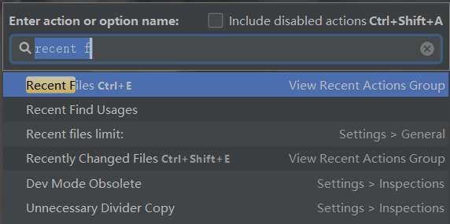

[TOC]


## 1、快捷键

### 1.1、查找快捷键（重要）

`Ctrl + Shift + A`：输入 action，查找对应快捷键

记住这个快捷键，其他快捷键不记得了用这个进行查找即可



如上图，查找最近打开过的文件。

### 1.2、跳转相关快捷键

| 快捷键 / Action                           | 解释说明           |
| ----------------------------------------- | ------------------ |
| Ctrl + E / Recent Files                   | 最近打开过的文件   |
| Ctrl + Alt + B / Implementation           | 跳转到接口的实现类 |
| Ctrl + Shift + E / Recent Change File     | 最近修改过的文件   |
| Ctrl + Alt + 左右方向键 / Back \| Forward | 返回上次浏览位置   |
|                                           |                    |
|                                           |                    |

### 1.3、查找相关快捷键

| 快捷键 / Action                 | 解释说明           |
| ------------------------------- | ------------------ |
| Ctrl + N / Class                | 查找类文件         |
| Ctrl + Shift + F / Find in Path | 跳转到接口的实现类 |
| Ctrl + Shift + N / File         | 查找项目中的文件   |
| Ctrl + Q / Quick Documentation  | 查看类或方法名文档 |
| Alt + F7 / Find Usages          | 查找引用           |

### 1.4、高效编码

| 快捷键 / Action                    | 解释说明                                |
| ---------------------------------- | --------------------------------------- |
| Alt + Insert / Generate            | 自动生成constructor、setter、getter等等 |
| Ctrl + Y / Delete line             | 删除一行                                |
| Ctrl + Alt + L / Reformat Code     | 格式化代码                              |
| Ctrl + Shift + R / Replace in path | 全局替换                                |
| Ctrl + R / Replace                 | 在当前文件替换                          |
| Ctrl + Shift + U / Toggle Case     | 切换大小写                              |
| Ctrl + Shift + -                   | 收缩所有代码                            |
| Ctrl + Shift + =                   | 展开所有代码                            |
| Ctrl + Alt + T / Surround with     | Surround with                           |
| Ctrl + /                           | 行注释                                  |
| Ctrl + Shift + /                   | 块注释                                  |
| Alt + Shift + 方向键 / Move Line   | 上移/下移代码                           |
| Alt + Enter                        | 自动导包、自动实现接口等等              |

### 1.5、重构

| 快捷键 / Action           | 解释说明           |
| ------------------------- | ------------------ |
| Ctrl + Alt + M / Method   | 提取当前选择为方法 |
| Ctrl + Alt + C / Constant | 提取当前选择为常量 |
| Ctrl + Alt + V / Variable | 提取当前选择为变量 |
| Shift + F6 / Rename       | 重命名             |


## 2、Post Fix 

- for ：`for(T item :expr)`
- nn ：`if (expr != null)`
- null ：`if (expr == null)`
- var :`T name = expr`
- sout ：`System.out.printlin(expr)`
- 更多查看 settings -> Editor -> General -> Postfix Completion

用法很简单

```java
//输入 i.sout ， 回车自动生成 System.out.printlin(i)
i.sout -> System.out.printlin(i)  
```

## 3、Live Templat

## 4、版本管理

## 5、断点调试