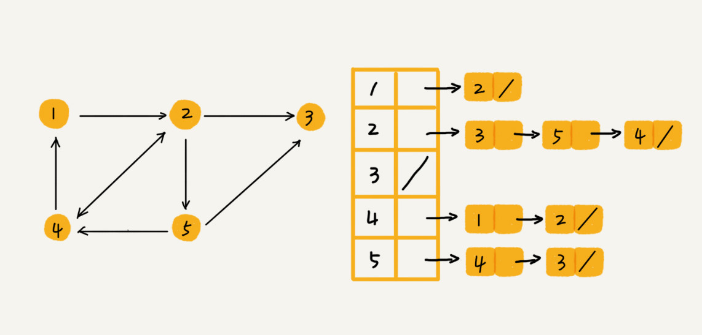

| 数据结构 |      |      |      |      |
| :------: | :--: | ---- | ---- | ---- |
|   数组   |      |      |      |      |
|   链表   |      |      |      |      |
|    栈    |      |      |      |      |
|   队列   |      |      |      |      |
|   跳表   |      |      |      |      |
|  散列表  |      |      |      |      |
|    树    |      |      |      |      |
|    堆    |      |      |      |      |
|    图    |      |      |      |      |

## 1、数组

## 2、链表

## 3、栈

## 4、队列

## 5、跳表

## 6、散列表

## 7、树

### Trie树

## 8、堆

## 9、图

### 9.1、图的种类

#### **9.1.1、无向图**

​		图是一种复杂的**非线性表结构**。图中的元素叫做**顶点**（vertex），顶点可以与其他任意顶点建立连接关系，这种建立的关系叫做**边**（edge）；跟顶点相连接的边的条数叫做顶点的**度**（degree），例如图中 A 的度为 3。

#### **9.1.2、有向图**

上图表示一种无向图，微博的社交关系允许单向关注，需要用**有向图**来表示。在有向图中，我们把度分为**入度**（In-degree）和**出度**（Out-degree）。

顶点的入度，表示有多少条边指向这个顶点，出度，表示有多少条边以这个顶点为起点指向其他顶点。对应到微博的例子，入度表示用户的粉丝量，出度表示用户关注的博主数量

#### **9.1.3、带权图**

在带权图中，每条边都有一个**权重**（weight）

### 9.2、存储方式

#### 9.2.1、邻接矩阵

图最直观的存储方式就是，邻接矩阵（Adjacency Matrix）

邻接矩阵的底层依赖一个**二维数组**。对于无向图来说，如果顶点 i 与顶点 j 之间有边，我们就将 `A[i][j]`和 `A[j][i]`标记为 1；对于有向图来说，如果顶点 i 到顶点 j 之间，有一条箭头从顶点 i 指向顶点 j 的边，那我们就将 `A[i][j]`标记为 1。同理，如果有一条箭头从顶点 j 指向顶点 i 的边，我们就将 `A[j][i]`标记为 1。对于带权图，数组中就存储相应的权重

**优点**

简单、直观。

基于数组，便于判断两个顶点之间是否有边；便于计算顶点的度；

方便计算，可以将很多图的运算转换成矩阵之间的运算。

**缺点**

不便于统计边的数目，不便于增加和删除顶点

存储**稀疏图**和**无向图**会浪费绝大部分空间。

对于无向图来说，如果 `A[i][j]`等于 1，那 `A[j][i]`也肯定等于 1。实际上，我们只需要存储一个就可以了。也就是说，无向图的二维数组中，如果我们将其用对角线划分为上下两部分，那我们只需要利用上面或者下面这样一半的空间就足够了，另外一半白白浪费掉了。

对于稀疏图来说，顶点很多，但每个顶点的边并不多。比如微信有好几亿的用户，对应到图上就是好几亿的顶点。但是每个用户的好友并不会很多，一般也就三五百个而已。如果我们用邻接矩阵来存储，那绝大部分的存储空间都被浪费了。

#### 9.2.2、邻接表

链表中存储的是与这个顶点相连接的其他顶点。

**优点**

便于增加和删除顶点；空间效率高，适用于存储稀疏图

**缺点**

相比邻接矩阵，邻接表查询两个顶点之间的关系没有那么高效，求出度容易，但求入度比较困难，我们可以采用逆邻接表来解决

### 9.3、应用实例

**数据结构是为算法服务的，具体选择哪种存储方式，与期望支持的操作有关系**。针对用户关系，假设我们需要支持下面几种操作：

- 判断用户 A 是否关注了用户 B；
- 判断用户 B 是否关注了用户 A；
- 用户 A 关注用户 B；
- 用户 A 取消关注用户 B；
- 根据用户名称的首字母排序，分页获取用户的粉丝列表；
- 根据用户名称的首字母排序，分页获取用户的关注列表。

因为社交网络是一张稀疏图，使用邻接表来存储更合适。但是使用邻接表有一个问题，获取顶点的出度（用户的关注列表）比较容易，但是求入度（用户的粉丝列表）是比较困难的。

所以，我们需要一个逆邻接表。邻接表中存储了用户的关注关系，逆邻接表中存储的是用户的被关注关系。

基础的邻接表不适合快速判断两个用户之间是否是关注与被关注的关系，所以我们选择改进版本，将邻接表中的链表改为支持快速查找的动态数据结构。选择哪种动态数据结构呢？红黑树、跳表、有序动态数组还是散列表呢？

因为我们需要按照用户名称的首字母排序，分页来获取用户的粉丝列表或者关注列表，用跳表这种结构再合适不过了。这是因为，跳表插入、删除、查找都非常高效，时间复杂度是 O(logn)，空间复杂度上稍高，是 O(n)。最重要的一点，**跳表中存储的数据本来就是有序**的了，分页获取粉丝列表或关注列表，就非常高效。

如果对于小规模的数据，比如社交网络中只有几万、几十万个用户，我们可以将整个社交关系存储在内存中，上面的解决思路是没有问题的。但是如果像微博那样有上亿的用户，数据规模太大，我们就无法全部存储在内存中了。这个时候该怎么办呢？

我们可以通过哈希算法等数据分片方式，将邻接表存储在不同的机器上。你可以看下面这幅图，我们在机器 1 上存储顶点 1，2，3 的邻接表，在机器 2 上，存储顶点 4，5 的邻接表。逆邻接表的处理方式也一样。当要查询顶点与顶点关系的时候，我们就利用同样的哈希算法，先定位顶点所在的机器，然后再在相应的机器上查找。

除此之外，我们还有另外一种解决思路，就是利用外部存储（比如硬盘），因为外部存储的存储空间要比内存会宽裕很多。数据库是我们经常用来持久化存储关系数据的，所以我这里介绍一种数据库的存储方式。

我用下面这张表来存储这样一个图。为了高效地支持前面定义的操作，我们可以在表上建立多个索引，比如第一列、第二列，给这两列都建立索引。

