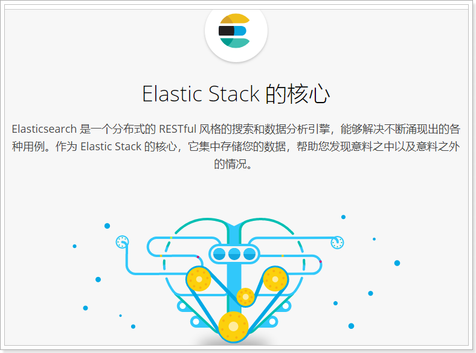
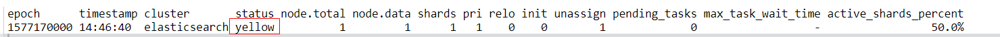
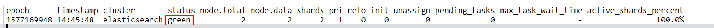
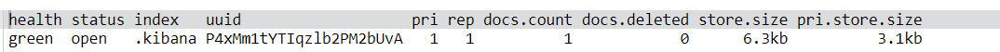

# sElasticsearch 介绍（5.2.0版本）

Elasticsearch官网：https://www.elastic.co/cn/products/elasticsearch

**Elasticsearch是一个分布式的 RESTful 风格的搜索和数据分析引擎，底层基于Lucene。**



如上所述，Elasticsearch具备以下特点：

- 分布式，无需人工搭建集群（solr就需要人为配置，使用Zookeeper作为注册中心）
- Restful风格，一切API都遵循Rest原则，容易上手，开箱即用
- 近实时搜索，数据更新在Elasticsearch中几乎是完全同步的。

## 1、倒排索引

倒排索引（Inverted index），是一种索引方法，被用来存储在全文搜索下**某个单词在一个文档或者一组文档中的存储位置的映射**。它是文档检索系统中最常用的**数据结构**。

看一个例子：

> - T0 = "`it is what it is`"
> - T1 = "`what is it`"
> - T2 = "`it is a banana`"

我们能够得到下面的反向文件索引

> ```json
>  "a":      {2}
>  "banana": {2}
>  "is":     {0, 1, 2}
>  "it":     {0, 1, 2}
>  "what":   {0, 1}
> ```

数据被拆分成了词与文档id列表的集合，这样只通过查询某个词，我们就可以知道哪些文档中有这些词，不用遍历所有文档，效率很高。上面只是最简单的结构，倒排索引还可以包括很多其他信息，比如单词被命中次数，在每个文档中出现的次数等。

> "a":      {(2, 2)}
> "banana": {(2, 3)}
> "is":     {(0, 1), (0, 4), (1, 1), (2, 1)}
> "it":     {(0, 0), (0, 3), (1, 2), (2, 0)} 
> "what":   {(0, 2), (1, 0)}

`"banana": {(2, 3)}`的意思是在第三个文档（T2）的第4个单词（地址为3）就是`banana`。

## 2、核心概念

ES中存储数据的**基本单位是索引**。

### 2.1、NRT（Near Realtime）

Elasticsearch 从插入一条数据到数据可以被查询有一个小延时，大概是1秒钟。

### 2.2、Cluster

集群，包含一个或多个`node`，每个`node`属于哪个集群是通过一个配置（集群名称，默认是 elasticsearch）来决定的。

### 2.3、Node

`node`是集群中的单个服务器，具备存储数据，参与集群索引及搜索的能力。与`Cluster`相似，` node`也有名称，启动后默认随机分配，并加入一个名称为 `elasticsearch`的集群中

`node`名称对于运维管理非常重要，我们可以通过名称来确定网络中的服务器是哪个`node `在你的`Elasticsearch Cluster `中

如果当前网络中没有启动任何 `Elasticsearch nodes`，启动一个 `node`就会组成一个名称为`elasticsearch`的单节点集群

### 2.4、Document & field

`document `是 `elasticsearch` 中最小的数据单元，一个`document`可以是一条客户数据，一条商品分类数据，一条订单数据，通常用JSON数据结构表示，每个`index`下的`type`中，都可以去存储多个`document`。一个`document`里面有多个`field`，每个`field`就是一个数据字段。

```json
product document

{
  "product_id": "1",
  "product_name": "高露洁牙膏",
  "product_desc": "高效美白",
  "category_id": "2",
  "category_name": "日化用品"
}
```

### 2.5、Index

`index` 包含了多个 `document`，一个 `index`就代表了一类类似的或者相同的 `document`

### 2.6、Type（6.0.及以上不支持）

一个 `index`包含了多个 `type`，一个`type`有多个`document`，每个`document`都有相同的 `filed`。举个例子就明白了

商品 `index`，里面存放了所有商品的`document`，但是商品有很多分类，每个分类的 `field`可能不一样。比如说电器商品，可能还包含一些诸如售后时间范围这样的特殊`field`；生鲜商品，还包含一些诸如生鲜保质期之类的特殊`field`，这时就需要分为多个`type`

`type`，日化商品`type`，电器商品`type`，生鲜商品`type`

日化商品`type`：product_id，product_name，product_desc，category_id，category_name
电器商品`type`：product_id，product_name，product_desc，category_id，category_name，service_period
生鲜商品`type`：product_id，product_name，product_desc，category_id，category_name，eat_period

有人认为 可以将`index`看作是`SQL`数据库的`database`，`type`看作是`table`，但其实是不准确的。

在 `SQL`数据库中，各个`table`之间是相互独立的，也就是说可以有相同的表字段。如`student`表可以有`id`，`teacher`也可以有`id`字段，这样并不会报错。但是在 `Elasticsearch`中，底层使用的`lucene`是没有`type`的概念的，在`document`中，实际上将`type`作为一个`document`的`field`来存储，即`_type`，`es`通过`_type`来进行`type`的过滤和筛选
一个`index`中的多个`type`，实际上是放在一起存储的，因此一个`index`下，不能有多个`type`重名。

```json
{
   "ecommerce": {
      "mappings": {
         "elactronic_goods": {
            "properties": {
               "name": {
                  "type": "string",
               },
               "price": {
                  "type": "double"
               },
	       "service_period": {
		  "type": "string"
	       }			
            }
         },
         "fresh_goods": {
            "properties": {
               "name": {
                  "type": "string",
               },
               "price": {
                  "type": "double"
               },
	       "eat_period": {
		  "type": "string"
	       }
            }
         }
      }
   }
}
//插入的两条 doucment
{
  "name": "geli kongtiao",
  "price": 1999.0,
  "service_period": "one year"
}

{
  "name": "aozhou dalongxia",
  "price": 199.0,
  "eat_period": "one week"
}

//底层存储是这样子的
{
   "ecommerce": {
      "mappings": {
        "_type": {
          "type": "string",
          "index": "not_analyzed"
        },
        "name": {
          "type": "string"
        }
        "price": {
          "type": "double"
        }
        "service_period": {
          "type": "string"
        }
        "eat_period": {
          "type": "string"
        }
      }
   }
}

{
  "_type": "elactronic_goods",
  "name": "geli kongtiao",
  "price": 1999.0,
  "service_period": "one year",
  "eat_period": ""
}

{
  "_type": "fresh_goods",
  "name": "aozhou dalongxia",
  "price": 199.0,
  "service_period": "",
  "eat_period": "one week"
}
```

可以得出结论，将类似结构的`type`放在一个`index`下，这些`type`应该有多个`field`是相同的

假如说，你将两个`type`的`field`完全不同，放在一个`inde`x下，那么就每条数据都至少有一半的`field`在底层的`lucene`中是空值，会有严重的性能问题

因为`type`的特性会导致一些性能问题，所以 `elasticsearch`在7.0版本就被标记为过时了。

[removal-of-types](https://www.elastic.co/guide/en/elasticsearch/reference/current/removal-of-types.html)

### 2.7、shard

单台机器无法存储大量数据，`es`可以将一个索引中的数据切分为多个`shard`，分布在多台服务器上存储。

有了`shard`就可以横向扩展，存储更多数据，让搜索和分析等操作分布到多台服务器上去执行，提升吞吐量和性能。

### 2.8、replica

任何一个服务器随时可能故障或宕机，此时`shard`可能就会丢失，因此可以为每个`shard`创建多个`replica`副本。每个`shard`都是一个`lucene index`。

`replica`可以在`shard`故障时提供备用服务，保证数据不丢失，多个`replica`还可以提升搜索操作的吞吐量和性能。`primary shard`（建立索引时一次设置，设置后不能修改，默认5个），`replica shard`（随时修改数量，默认1个），默认每个索引10个`shard`，5个`primary shard`，5个`replica shard`，最小的高可用配置，是2台服务器。

为什么`primary shard`设置后就不能修改了？


**要注意的是：Elasticsearch本身就是分布式的，因此即便你只有一个节点，Elasticsearch默认也会对你的数据进行分片和副本操作，当你向集群添加新数据时，数据也会在新加入的节点中进行平衡。**

## 3、常用 restful api

### 3.1、查看集群健康状态

`GET _cat/health?v`



集群的健康状况分为以下三种：

1. green：每个索引的`primary shard`和 `replica shard`都是`active`状态的
2. yellow：每个索引的`primary shard`都是`active`状态的，但是部分`replica shard`不是`active`状态，处于不可用的状态
3. red：不是所有索引的`primary shard`都是`active`状态的，部分索引有数据丢失了

那么，为什么刚启动es，集群状态会是 `yellow` 的呢？

这是因为我们只启动了一个 es 进程，相当于只有一个 node。现在 es 中有一个 kibana 自己内置建立的 index，由于 es5.2 默认的配置是给每个 index 分配 5 个 `primary shard` 和 5个 `replica shard`，但是一个 `primary shard` 不能与它的`replica shard`在同一台机器上（容错性），所以现在集群的状态是 一个 `active` 的 `primary shard`，而它的 `replica shard` 没有第二台机器去启动，此时如果我们再打开一个 es 进程，集群的状态就会变成 `green` 了。（解压下载下来的 es安装包，再启动 es，节点会自动加入集群。）



如果我使用的是 es7.2 版本，第一次启动 es时集群的状态就是 `green` 了，可能是默认配置变动了。

### 3.2、简单的索引操作

#### 3.2.1、查看索引

`GET _cat/indices?v`



#### 3.2.2、创建索引

`PUT my_index`

#### 3.2.3、删除索引

`DELETE my_index`

### 3.3、商品的CRUD操作

#### 3.3.1、新增商品：新增文档，建立索引

`PUT /index/type/id {"json 数据"}`

```json
PUT /mall/product/1
{
  "name" : "gaolujie yaogao",
  "desc" : "gaoxiao meibai",
  "price": 30,
  "producer": "gaolujie producer",
  "tags": ["meibai","fangzhu"]
}

{
  "_index": "mall",
  "_type": "product",
  "_id": "1",
  "_version": 1,
  "result": "created",
  "_shards": {
    "total": 2,
    "successful": 2,
    "failed": 0
  },
  "created": true
}
```

#### 3.3.2、查询商品：检索文档

- 查询某个商品：`GET /index/type/id`

```json
get /mall/product/1

{
  "_index": "mall",
  "_type": "product",
  "_id": "1",
  "_version": 1,
  "found": true,
  "_source": {
    "name": "gaolujie yaogao",
    "desc": "gaoxiao meibai",
    "price": 30,
    "producer": "gaolujie producer",
    "tags": [
      "meibai",
      "fangzhu"
    ]
  }
}
```

- `query string search`
- 查询所有商品：`GET/index/type/_search`

```json
GET /mall/product/_search

{
  "took": 8,  # 搜索耗时
  "timed_out": false, #是否超时
  "_shards": {
    "total": 5,    #数据拆成了5个分片，对于搜索请求，会打到所有的primary shard 或 replica shard
    "successful": 5,
    "failed": 0
  },
  "hits": {
    "total": 2, #查询结果的数量， 2个document
    "max_score": 1, #document 对于一个 search 的相关度的匹配分数，越相关，就越匹配，分数也越高
    "hits": [    # document的详细数据
      {
        "_index": "mall",
        "_type": "product",
        "_id": "2",
        "_score": 1,
        "_source": {
          "name": "jiajieshi yagao",
          "desc": "youxiao fangzhu",
          "price": "10",
          "producer": "jiajieshi producer",
          "tags": [
            "fangzhu"
          ]
        }
      },
      {
        "_index": "mall",
        "_type": "product",
        "_id": "3",
        "_score": 1,
        "_source": {
          "name": "zhonghua yagao",
          "desc": "caoben zhiwu",
          "price": 40,
          "producer": "zhonghua producer",
          "tags": [
            "qingxin"
          ]
        }
      }
    ]
  }
}
```

- 搜索指定商品

```json
#搜索商品名称包含‘yagao’的商品，并且按照售价降序排序
get /mall/product/_search?q=name:yagao&sort=price:desc
```

在生产环境中，几乎很少使用`query string search`

#### 3.3.3、修改商品：替换文档

`PUT /index/type/id{"json 数据"}`

```json
put /mall/product/1
{
   "name" : "gaolujie yaogao",
  "desc" : "gaoxiao meibai",
  "price": 25,
  "producer": "gaolujie producer",
  "tags": ["meibai","fangzhu"]
}

{
  "_index": "mall",
  "_type": "product",
  "_id": "1",
  "_version": 2,
  "result": "updated",
  "_shards": {
    "total": 2,
    "successful": 2,
    "failed": 0
  },
  "created": false
}
```

**注意，替换文档有一个缺点，就是每次替换，我们都必须带上所有的 field，才能进行信息的修改。**

#### 3.3.4、修改商品：更新文档

`POST /index/type/id/_update{"doc":{"json 数据"}}`

```json
POST /mall/product/2/_update
{
  "doc":{
    "price" : "10"
  }
}

{
  "_index": "mall",
  "_type": "product",
  "_id": "2",
  "_version": 2,
  "result": "updated",
  "_shards": {
    "total": 2,
    "successful": 2,
    "failed": 0
  }
}
```

3.3.5、删除商品：删除文档

`DELETE /index/type/id`

```json
delete /mall/product/1

{
  "found": true,
  "_index": "mall",
  "_type": "product",
  "_id": "1",
  "_version": 4,
  "result": "deleted",
  "_shards": {
    "total": 2,
    "successful": 2,
    "failed": 0
  }
}

//再执行两次
{
  "found": false,
  "_index": "mall",
  "_type": "product",
  "_id": "1",
  "_version": 6,     
  "result": "not_found",
  "_shards": {
    "total": 2,
    "successful": 2,
    "failed": 0
  }
}
```

### 3.4、query DSL

`DSL`：`Domain Specified Language`，特定领域语言

`http request body`：请求体，可以用 json 的格式来构建查询语法，比较方便，可以构建各种复杂的语法，比 query string search 肯定强大多了。

```json
#查询所有商品
GET /mall/product/_search
{
  "query": {
    "match_all": {}
  }
}

#搜索商品名称包含‘yagao’的商品，并且按照售价降序排序
GET /mall/product/_search
{
  "query": {
    "match": {
      "name" : "yagao"
    }
  },
  "sort": [
    {"price" : "desc"}
    ]
}

#分页查询商品，总共3条商品，假设每页就显示1条商品，现在显示第2页，所以就查出来第2个商品
GET /mall/product/_search
{
  "query": {"match_all": {}},
  "from": 1,   #从第一页开始查
  "size": 1    #每页查1条
}


#前面都是会查出商品的所有信息，现在我们只需要商品和价格信息
GET /mall/product/_search
{
  "query": {"match_all": {}},
  "_source": ["name","price"]
}
```

#### 3.4.1、全文检索

```json
#搜索 field 为 producer，值为 yagao producer的商品
GET /mall/product/_search
{
  "query": {
    "match": {
      "producer": "yagao producer"   #分词，‘yagao’，‘producer’,构建倒排索引
    }
  }
}
```

### 3.4.2、phrase search（短语搜索）

跟全文检索相反，全文检索会将输入的搜索串拆解开来，去倒排索引里面去一一匹配，只要能匹配上任意一个拆解后的单词，就可以作为结果返回
phrase search，要求输入的搜索串，必须在指定的字段文本中，完全包含一模一样的，才可以算匹配，才能作为结果返回

```json
GET /mall/product/_search
{
  "query": {
    "match_phrase": {
      "producer": "zhonghua producer"
    }
  }
}

#高亮搜索结果
GET /mall/product/_search
{
  "query": {
    "match": {
      "producer": "producer"
    }
  },
  "highlight": {
    "fields": {
      "producer":{}
    }
  }
}
```


### 3.5、query filter

```json
#搜索商品名称包含'yagao',且售价大于25元的商品
GET /mall/product/_search
{
  "query": {
    "bool" : {
      "must" : {
        "match" : {
          "name" : "yagao"
        }
      },
      "filter": {   
        "range": {
          "price": {
            "gt": 20
          }
        }
      }
    }
  }
}
```

### 3.6、聚合查询

聚合可以让我们极其方便的实现对数据的统计、分析。例如：

- 什么品牌的手机最受欢迎？
- 这些手机的平均价格、最高价格、最低价格？
- 这些手机每月的销售情况如何？

实现这些统计功能的比数据库的sql要方便的多，而且查询速度非常快，可以实现近实时搜索效果。

Elasticsearch中的聚合，包含多种类型，最常用的两种，一个叫`桶`，一个叫`度量`：

桶的作用，是按照某种方式对数据进行分组，每一组数据在ES中称为一个`桶`，例如我们根据国籍对人划分，可以得到`中国桶`、`英国桶`，`日本桶`……或者我们按照年龄段对人进行划分：0~10,10~20,20~30,30~40等。

Elasticsearch中提供的划分桶的方式有很多：

- `Date Histogram Aggregation`：根据日期阶梯分组，例如给定阶梯为周，会自动每周分为一组
- `Histogram Aggregation`：根据数值阶梯分组，与日期类似
- `Terms Aggregation`：根据词条内容分组，词条内容完全匹配的为一组
- `Range Aggregation`：数值和日期的范围分组，指定开始和结束，然后按段分组
- ……

综上所述，我们发现`bucket aggregations `只负责对数据进行分组，并不进行计算，因此往往`bucket`中往往会嵌套另一种聚合：`metrics aggregations`即`度量`

> **度量（metrics）**

分组完成以后，我们一般会对组中的数据进行聚合运算，例如求平均值、最大、最小、求和等，这些在ES中称为`度量`

比较常用的一些度量聚合方式：

- `Avg Aggregation`：求平均值
- `Max Aggregation`：求最大值
- `Min Aggregation`：求最小值
- `Percentiles Aggregation`：求百分比
- `Stats Aggregation`：同时返回`avg`、`max`、`min`、`sum`、`count`等
- `Sum Aggregation`：求和
- `Top hits Aggregation`：求前几
- `Value Count Aggregation`：求总数

#### 3.6.1、聚合为桶

将牙膏按照`tags`来划分`桶`

```json

#将文本field的fielddata属性设置为true，否则直接进行聚合可能报错

PUT /ecommerce/_mapping/product
{
  "properties": {
    "tags": {
      "type": "text",
      "fielddata": true
    }
  }
}
```


```json
GET /mall/product/_search
{
  "size":0,   #查询条数，我们只关心聚合结果，所以设置为0
  "aggs": {   #声明聚合查询，
    "group_by_tag": {
      "terms": {"field": "tags"}
    }
  }
}


{
  "took": 10,
  "timed_out": false,
  "_shards": {
    "total": 5,
    "successful": 5,
    "failed": 0
  },
  "hits": {
    "total": 2,
    "max_score": 0,
    "hits": []  #查询结果为空，因为我们 size 为0
  },
  "aggregations": { #聚合的结果
    "group_by_tag": {  #自定义的聚合名称
      "doc_count_error_upper_bound": 0,
      "sum_other_doc_count": 0,
      "buckets": [   #查找到的桶，每个不同的 tags 字段都会形成一个桶
        {
          "key": "fangzhu",   # tags 字段对应的值
          "doc_count": 1      #桶中的文档数量
        },
        {
          "key": "qingxin",
          "doc_count": 1
        }
      ]
    }
  }
}
```

#### 3.6.2、桶内度量

前面的例子告诉我们每个桶里面的文档数量，这很有用。 但通常，我们的应用需要提供更复杂的文档度量。例如，每种`tag`牙膏的平均价格是多少？

因此，我们需要告诉Elasticsearch`使用哪个字段`，`使用何种度量方式`进行运算，这些信息要嵌套在`桶`内，`度量`的运算会基于`桶`内的文档进行

现在，我们为刚刚的聚合结果添加求价格平均值的度量：

```json
GET /mall/product/_search
{
  "size":0,
  "aggs": {
    "group_by_tag": {
      "terms": {
        "field": "tags"
      },
      "aggs":{   #在上一个 aggs（group_by_tag）中添加新的aggs
      "avg_price": {
        "avg": {  #度量的类型，这里是求平均值
          "field": "price"  #度量运算的字段
         }
       }
     }
   }    
 }
}

{
  "took": 4,
  "timed_out": false,
  "_shards": {
    "total": 5,
    "successful": 5,
    "failed": 0
  },
  "hits": {
    "total": 2,
    "max_score": 0,
    "hits": []
  },
  "aggregations": {
    "group_by_tag": {
      "doc_count_error_upper_bound": 0,
      "sum_other_doc_count": 0,
      "buckets": [
        {
          "key": "fangzhu",
          "doc_count": 1,
          "avg_price": {  #度量结果
            "value": 10
          }
        },
        {
          "key": "qingxin",
          "doc_count": 1,
          "avg_price": {  
            "value": 40
          }
        }
      ]
    }
  }
}
```

#### 3.6.3、桶内嵌套桶

刚刚的案例中，我们在桶内嵌套度量运算。事实上桶不仅可以嵌套运算， 还可以再嵌套其它桶。也就是说在每个分组中，再分更多组。

计算每个tag下的商品的平均价格，并且按照平均价格降序排序

```json
GET /mall/product/_search
{
  "size":0,
  "aggs": {
    "all_tags": {
      "terms": {
        "field": "tags",
        "order":{"avg_price":"desc"}
      },
      "aggs":{
      "avg_price": {
        "avg": {
          "field": "price"
         }
       }
     }
   }
 }
}

 "aggregations": {
    "all_tags": {
      "doc_count_error_upper_bound": 0,
      "sum_other_doc_count": 0,
      "buckets": [
        {
          "key": "qingxin",
          "doc_count": 1,
          "avg_price": {
            "value": 40
          }
        },
        {
          "key": "fangzhu",
          "doc_count": 1,
          "avg_price": {
            "value": 10
          }
        }
      ]
    }
  }
```

按照指定的价格范围区间进行分组，然后在每组内再按照tag进行分组，最后再计算每组的平均价格

```json
GET /mall/product/_search
{
  "size":0,
  "aggs": {
    "group_by_price": {
      "range": {
        "field": "price",
        "ranges": [
          {
            "from": 0,
            "to":20
          },
          {
            "from": 20,
            "to":40
          },
          {
            "from": 40,
            "to":50
          }
        ]
      },
      "aggs": {
        "group_by_tags": {
          "terms": {
            "field": "tags"
          },
          "aggs":{
            "average_price":{
              "avg": {
                "field": "price"
              }
            }
          }
        }
      }
    }
  }
}

"aggregations": {
    "group_by_price": {
      "buckets": [
        {
          "key": "0.0-20.0",
          "from": 0,
          "to": 20,
          "doc_count": 1,
          "group_by_tags": {
            "doc_count_error_upper_bound": 0,
            "sum_other_doc_count": 0,
            "buckets": [
              {
                "key": "fangzhu",
                "doc_count": 1,
                "average_price": {
                  "value": 10
                }
              }
            ]
          }
        },
        {
          "key": "20.0-40.0",
          "from": 20,
          "to": 40,
          "doc_count": 3,
          "group_by_tags": {
            "doc_count_error_upper_bound": 0,
            "sum_other_doc_count": 0,
            "buckets": [
              {
                "key": "fangzhu",
                "doc_count": 3,
                "average_price": {
                  "value": 20
                }
              },
              {
                "key": "kangjun",
                "doc_count": 1,
                "average_price": {
                  "value": 20
                }
              },
              {
                "key": "meibai",
                "doc_count": 1,
                "average_price": {
                  "value": 20
                }
              },
              {
                "key": "shajun",
                "doc_count": 1,
                "average_price": {
                  "value": 20
                }
              }
            ]
          }
        },
        {
          "key": "40.0-50.0",
          "from": 40,
          "to": 50,
          "doc_count": 0,
          "group_by_tags": {
            "doc_count_error_upper_bound": 0,
            "sum_other_doc_count": 0,
            "buckets": []
          }
        }
      ]
    }
  }
```

