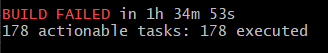

## 1、搭建准备工作

### 1.1、安装 gradle

`Spring Framework` 使用 `Gradle` 进行构建，在环境搭建之前，我们需要先安装 [Gradle](https://www.cnblogs.com/linkstar/p/7899191.html)工具。

### 1.2、安装 git 和 JDK 8 

此外，搭建环境还需要 Git 和  [JDK 8 update 60 or later](https://www.oracle.com/technetwork/java/javase/downloads/index.html) 。确保`JAVA_HOME`环境变量指向从JDK下载中提取的`jdk1.8.0`文件夹

## 2、获取源代码并构建

```shell
git clone git@github.com:spring-projects/spring-framework.git
cd spring-framework

# 编译、测试、构建所有 Jars，发布压缩包和文档，这一步可能需要科学上网，build 失败多build几次，有可能网络问题
./gradlew build
```

