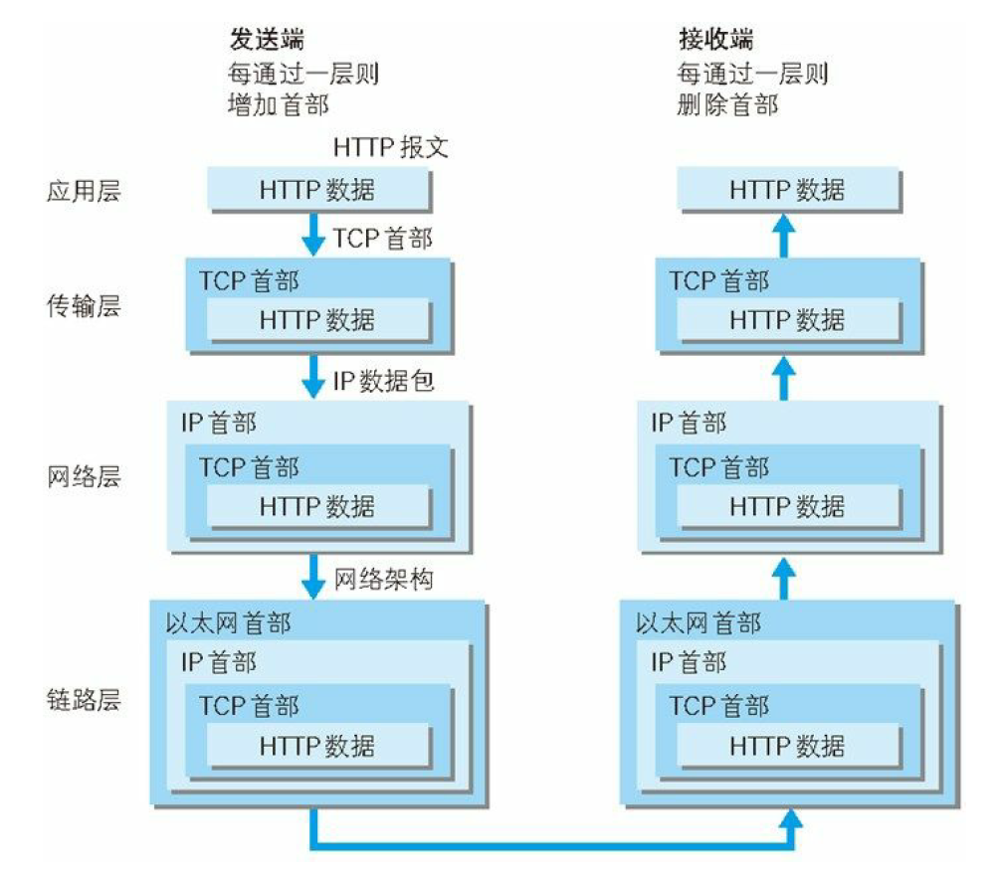

## 1、网络基础TCP/IP

为了理解 HTTP，我们有必要事先了解一下 TCP/IP 协议族。通常使用的网络（包括互联网）是在 TCP/IP 协议族的基础上运作的。而 HTTP 属于它内部的一个子集。

### 1.1、TCP/IP协议族

计算机与网络设备要相互通信，双方就必须基于相同的规则。我们把这种规则称为**协议（protocol）**。

协议中存在各式各样的内容。从电缆的规格到 IP 地址的选定方法、寻找异地用户的方法、双方建立通信的顺序，以及Web 页面显示需要处理的步骤，等等。

像这样把与互联网相关联的协议集合起来总称为 TCP/IP。也有说法认为，TCP/IP 是指 TCP 和 IP 这两种协议。还有一种说法认为，TCP/IP 是在 IP 协议的通信过程中，使用到的协议族的统称。

​													图：TCP/IP 是互联网相关的各类协议族的总称

### 1.2、TCP/IP 的分层管理

TCP/IP 协议族里重要的一点就是分层。TCP/IP 协议族按层次分别分为以下 4 层：**应用层、传输层、网络层和数据链路层。**分层让设计和修改变动变得更加简单

#### 1.2.1、应用层

应用层决定了向用户提供应用服务时通信的活动。

TCP/IP 协议族内预存了各类通用的应用服务。比如，FTP（File Transfer Protocol，文件传输协议）和 DNS（Domain Name System，域名系统）服务就是其中两类。

HTTP 协议也处于该层。

#### 1.2.2、传输层

传输层对上层应用层，提供处于网络连接中的两台计算机之间的数据传输。

在传输层有两个性质不同的协议：TCP（Transmission Control Protocol，传输控制协议）和 UDP（User Data Protocol，用户数据报协议）。

#### 1.2.3、网络层

网络层用来处理在网络上流动的数据包。数据包是网络传输的最小数据单位。该层规定了通过怎样的路径（所谓的传输路线）到达对方计算机，并把数据包传送给对方。

#### 1.2.4、数据链路层

用来处理连接网络的硬件部分。包括控制操作系统、硬件的设备驱动、NIC（Network Interface Card，网络适配器，即网卡），及光纤等物理可见部分（还包括连接器等一切传输媒介）。硬件上的范畴均在链路层的作用范围之内。

### 1.3、TCP/IP 通信传输流

利用 TCP/IP 协议族进行网络通信时，会通过分层顺序与对方进行通信。发送端从应用层往下走，接收端则往应用层往上走。

我们用 HTTP 举例来说明，首先作为发送端的客户端在**应用层（HTTP 协议）**发出一个想看某个 Web 页面的 HTTP 请求。

接着，为了传输方便，在**传输层（TCP 协议）**把从应用层处收到的数据（HTTP 请求报文）进行**分割**，并在各个报文上打上标记序号及端口号后**转发**给网络层。

在**网络层（IP 协议）**，增加作为通信目的地的 **MAC 地址**后转发给链路层。这样一来，发往网络的通信请求就准备齐全了。

接收端的服务器在链路层接收到数据，按序往上层发送，一直到应用层。当传输到应用层，才能算真正接收到由客户端发送过来的 HTTP 请求。

发送端在层与层之间传输数据时，每经过一层时必定会被打上一个该层所属的首部信息。反之，接收端在层与层传输数据时，每经过一层时会把对应的首部消去。

这种把数据信息包装起来的做法称为**封装（encapsulate）**。