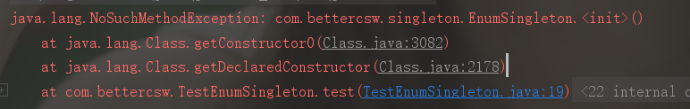
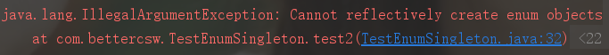

## 1、什么是单例模式？

### 1.1、单例模式的原则

单例模式保证类只有一个实例，并且提供一个访问该实例的全局访问点。

**优点：**只生成一个实例，减少系统性能开销。当实例化一个对象需要比较多的资源时，则可以在应用启动时直接产生一个单例对象，将其永驻在内存中。

### 1.2、实现单例模式的思路

1. 构造方法私有
2. 初始化对象后指向私有静态属性
3. 公有静态方法获取对象实例

## 2、单例模式的几种实现方式

### 2.1、饿汉式

饿汉式单例模式中，static 变量会在类装载时初始化，此时没有线程安全问题。虚拟机只会装载一次该类。

```java
public class Singleton {
    
    private static Singleton uniqueInstance = new Singleton();
    
    private Singleton() {}
    
    public static Singleton getUniqueInstance() {
        return uniqueInstance;
    }
}
```

**优点：**线程安全，调用效率高

**缺点：**不能延时加载，可能造成资源浪费

### 2.2、懒汉式

```java
public class Singleton {
    
    private static Singleton uniqueInstance;
    
    private Singleton() {}
    
    public static synchronized Singleton getUniqueInstance() {
       if(uniqueInstance == null) {
           uniqueInstance = new Singleton();
       }
        return uniqueInstance;
    }
}
```

**优点：**支持延迟加载，资源利用率高

**缺点：**方法需要同步，并发效率低

### 2.3、双重校验锁

双重校验锁解决了懒汉式并发效率低的问题，只有在第一次获取该类实例时需要进行同步，极大提高了并发效率。

```java
public class Singleton {
    //防止指令重排
    private volatile static Singleton uniqueInstance;
    
    private Singleton() {}
    
    public static Singleton getUniqueInstance() { 
       if(uniqueInstance == null) {
           synchronized(Singleton.class) {
               if(uniqueInstance == null) {
                   uniqueInstance = new Singleton();
               }
           }
       }
        return uniqueInstance;
    }
}
```

这里为什么需要两条`if`语句呢？假设我们只有一条`if`语句

```java
if(uniqueInstance == null) {
    synchronized(Singleton.class) {
        uniqueInstance = new Singleton();
    }
}
```

考虑以下场景：在`uniqueInstance == null` 时，有两个线程同时执行了`if`语句，那么这两个线程就会进入到`if`语句块内，虽有语句块中有同步语句，但是在第一个线程执行完成后，对象实例已经被创建，此时第二个线程又创建了一个新的实例，问题就出现了。因此必须使用双重校验锁，也即需要两个`if`语句。

**注意：**uniqueInstance 采用`volatile` 关键字修饰是很有必要的， `uniqueInstance = new Singleton();`这段代码其实是分为三步执行的：

1. **为  uniqueInstance 分配内存空间**
2. **初始化 uniqueInstance** 
3. **将 uniqueInstance 指向分配的内存地址**

但是由于 JVM 具有指令重排的特性，执行顺序有可能变成 1 -> 3 -> 2。指令重排在单线程环境下不会出现问题，但是在多线程环境下会导致一个线程获得还没有初始化的实例。例如，线程 T<sub>1</sub> 执行了 1 和 3，此时 T<sub>2</sub> 调用 getUniqueInstance() 后发现 uniqueInstance 不为空，因此返回 uniqueInstance，但此时 uniqueInstance 还未被初始化。

使用 volatile 可以禁止 JVM 的指令重排，保证在多线程环境下也能正常运行。

### 2.4、静态内部类

当 `Singleton` 类被加载时，静态内部类 `InnerClass`没有被加载进内存。只有当调用 `getUniqueInstance()`方法时，`InnerClass`才会被加载，此时初始化 `UNIQUEINSTANCE`实例，并且 JVM 能确保该实例只被实例化一次。

**优点：**可以延迟加载，且 JVM 提供了对线程安全的支持，兼顾了饿汉式单例模式的内存浪费问题和懒汉式`synchronized`的性能问题

```java
public class Singleton {
    
    private Singleton() {
        //防止利用反射创建多个实例
        if(InnerClass.UNIQUEINSTANCE != null) {
            throw new RuntimeException("不允许创建多个实例");
        }
    }
    
    private static class InnerClass {
        private static final Singleton UNIQUEINSTANCE = new Singleton();
    }
    public static final Singleton getUniqueInstance() {
        return InnerClass.UNIQUEINSTANCE;
    }
}
```

### 2.5、枚举

```java
public enum Singleton {
    //定义枚举元素，代表了一个Singleton实例
    UNIQUEINSTANCE;
        
    public void singletonOperation() {
        //功能处理
    }
}
```

**优点：**实现简单；枚举本身就是单例，由 JVM 从根本上提供保障！避免通过反射和序列化的漏洞。

**缺点：**无法延时加载

那么问题来了，枚举为什么是单例的？它又是如何避免通过反射和序列化来创建多实例的呢？

通过反编译工具 [Jad](https://varaneckas.com/jad/) 反编译 `EnumSingleton `的 class 文件，得到 .jad 后缀文件。打开文件，我们可以发现有如下代码

```java
static 
    {
        INSTANCE = new EnumSingleton("INSTANCE", 0);
        $VALUES = (new EnumSingleton[] {
            INSTANCE
        });
    }
```

枚举单例模式在静态代码块中就给 INSTANCE 进行了赋值，是饿汉式单例模式的实现。这就解释了枚举为什么的单例的。

那么序列化不能破坏枚举单例跟 `ObjectInputStream`的 `readObject0()`方法有关。通过查看源码可以发现， `readObject0()`方法调用了一个叫做 `readEnum()`的方法，`readEnum() `方法代码实现如下：

```java
private Enum<?> readEnum(boolean unshared) throws IOException {
        if (bin.readByte() != TC_ENUM) {
            throw new InternalError();
        }

        ObjectStreamClass desc = readClassDesc(false);
        if (!desc.isEnum()) {
            throw new InvalidClassException("non-enum class: " + desc);
        }

        int enumHandle = handles.assign(unshared ? unsharedMarker : null);
        ClassNotFoundException resolveEx = desc.getResolveException();
        if (resolveEx != null) {
            handles.markException(enumHandle, resolveEx);
        }

        String name = readString(false);
        Enum<?> result = null;
        Class<?> cl = desc.forClass();
        if (cl != null) {
            try {
                //通过类名和对象类找到枚举对象
                @SuppressWarnings("unchecked")
                Enum<?> en = Enum.valueOf((Class)cl, name);
                result = en;
            } catch (IllegalArgumentException ex) {
                throw (IOException) new InvalidObjectException(
                    "enum constant " + name + " does not exist in " +
                    cl).initCause(ex);
            }
            if (!unshared) {
                handles.setObject(enumHandle, result);
            }
        }

        handles.finish(enumHandle);
        passHandle = enumHandle;
        return result;
    }
```

我们发现，枚举类型其实通过**类名**和**对象类**找到一个唯一的枚举对象。因此，枚举对象不可能被类加载器加载多次。那么反射是否能破坏枚举单例呢？

```java
@Test
    public void test() {

        try {
            Class clazz = EnumSingleton.class;
            Constructor c = clazz.getDeclaredConstructor();
            c.newInstance();
        } catch (Exception e) {
            e.printStackTrace();
        }
    }
```

运行结果如下图：



结果中报的是`java.lang.NoSucnMethodException`，意思是没找到无参的构造方法。这时我们打开`java.lang.Enum`的源码，查看它的构造方法，只有一个 `protected`类型的构造方法，代码如下：

```java
protected Enum(String name, int ordinal) {
        this.name = name;
        this.ordinal = ordinal;
    }
```

问题找到了，那么我们再来测试一下：

```java
    @Test
    public void test2() {

        try {
            Class clazz = EnumSingleton.class;
            Constructor c = clazz.getDeclaredConstructor(String.class,int.class);
            c.setAccessible(true);
            EnumSingleton tom = (EnumSingleton)c.newInstance("Tom", 666);
        } catch (Exception e) {
            e.printStackTrace();
        }
    }
```

运行结果如下：



这个异常结果就非常明显了，`Cannot reflectively create enum objects`，无法通过反射创建枚举对象。还是通过源码分析，进入 `Constructor` 的 `newInstance()`

```java
public T newInstance(Object ... initargs)
        throws InstantiationException, IllegalAccessException,
               IllegalArgumentException, InvocationTargetException
    {
        ...
        if ((clazz.getModifiers() & Modifier.ENUM) != 0)
            throw new IllegalArgumentException("Cannot reflectively create enum objects");
        ConstructorAccessor ca = constructorAccessor;   // read volatile
        ...
        @SuppressWarnings("unchecked")
        T inst = (T) ca.newInstance(initargs);
        return inst;
    }
```

到此为止，我们已经非常清晰明了了。

## 3、破坏单例

除了枚举单例模式，其他单例都是可以被破坏的，有反射和序列化两种方式。

### **3.1、反射破坏单例：**

```java
public class SingletonTest {
    public static void main(String[] args) {
        Class<?> clazz = Singleton.class;
        try {
            //通过反射获取私有的构造方法
            Constructor c = clazz.getDeclaredConstructor(null);
            //让类中所有属性可访问，包括 private
            c.setAccessible(true);
            //暴力初始化
            Object o1 = c.newInstance();
            //调用了两次构造方法，产生了两个实例
            Object o2 = c.newInstance();
            System.out.println(o1 == o2);
        }  catch (Exception e) {
            e.printStackTrace();
        }
    }
}
```

### **3.2、序列化破坏单例：**

一个单例对象创建好后，有时候需要将对象序列化然后写入磁盘，下次使用时再从磁盘中读取对象并进行反序列化，将其转化为内存对象。反序列化后的对象会重新分配内存，即重新创建。如果序列化的目标对象为单例对象，就违背了单例模式的初衷。

实例了`Serializable`接口的单例

```java
public class SerializableSingleton implements Serializable{

    private final static SerializableSingleton INSTANCE = new SerializableSingleton();
    private SerializableSingleton(){}

    public static SerializableSingleton getInstance() {
        return INSTANCE;
    }
}
```

通过序列化破坏单例

```java
public class SerializableSingletonTest {

    public static void main(String[] args) {
        SerializableSingleton s1 = null;
        SerializableSingleton s2 = SerializableSingleton.getInstance();

        FileOutputStream fos = null;
        File file;
        try {
            fos = new FileOutputStream("test");
            ObjectOutputStream oos = new ObjectOutputStream(fos);
            oos.writeObject(s2);
            oos.flush();
            oos.close();

            FileInputStream fis = new FileInputStream("test");
            ObjectInputStream ois = new ObjectInputStream(fis);
            s1 = (SerializableSingleton) ois.readObject();
            ois.close();

            System.out.println(s1 == s2);   //false
        } catch (Exception e) {
            e.printStackTrace();
        }
    }
}
```

那么，我们如何保证在序列化的情况下也能够实现单例模式呢？很简单，只需要在单例类中添加 `readResolve()`方法即可。看优化后的代码：

```java
public class SerializableSingleton implements Serializable{

    private final static SerializableSingleton INSTANCE = new SerializableSingleton();
    private SerializableSingleton(){}

    public static SerializableSingleton getInstance() {
        return INSTANCE;
    }
    //新添加的代码
    private Object readResolve() {
        return INSTANCE;
    }
}
```

能产生如此神奇的效果，答案就在 `ObjectInputStream `类的 `readObject0()` 方法源码中，有兴趣的可自行查看,其底层原理还是依靠反射来调用单例类中的`readResolve()`方法，但是在此之前程序已经用无参构造函数实例化了新的对象，只是返回的是通过反射得到的对象。所以这里存在额外的内存开销，还是不够完美。


## 4、单例模式的应用场景

**适合使用单例模式的场景：**

1. 需要频繁实例化然后销毁的对象
2. 创建时耗时较长或损耗较大，却经常使用的对象
3. 有状态的工具类对象
4. 频繁访问数据库或文件的对象
5. 资源共享的情况下，避免由于资源操作时导致的性能损耗。

**单例模式的经典使用场景：**

1. windows 的任务管理器和回收站
2. 网站的计数器（同步方便）
3. 应用程序的日志应用：共享的日志文件一直处于打开状态，因此只能有一个实例去操作，否则内容不好追加
4. Web 应用的配置对象的读取：配置文件时共享的资源。
5. 多线程的线程池设计（方便对池中的线程进行控制）
6. 数据库连接池的设计（节省打开或关闭数据库连接所引起的损耗）
7. ...


