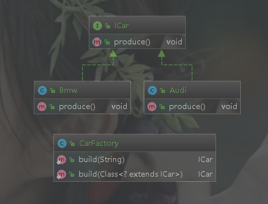
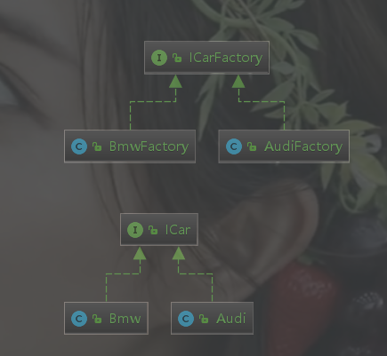
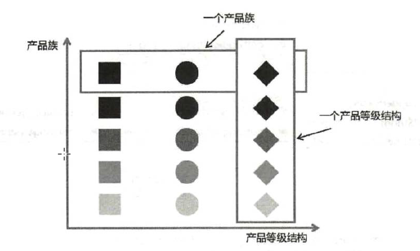
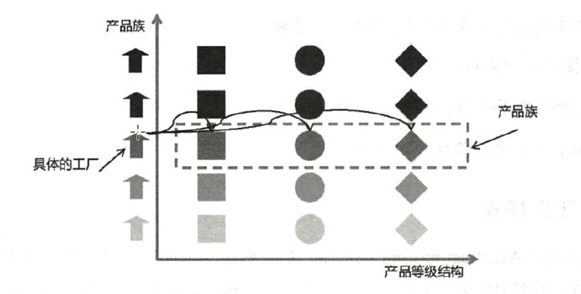

## 1、简单工厂模式

简单工厂模式（Simple Factory Pattern）是指由一个工厂对象决定创建哪一种产品类的实例，但它不属于 GoF 的 23 种设计模式。简单工厂模式适用于工厂类负责创建的对象比较少的场景，且客户端只需要传入工厂类的参数，对于如何创建对象不需要关心。以代码为例：我们定义一个汽车标准 ICar 接口：

```java
public interface ICar {
    /**
     * 生产汽车
     */
    void produce();
}
```

创建一个 Audi 类实现 ICar 接口：

```java
public class Audi implements ICar {
    @Override
    public void produce() {
        System.out.println("生产奥迪汽车");
    }
}
```

我们会这样写客户端调用代码：

```java
public static void main(String[] args) {
    ICar car = new Audi();
    car.produce();
}
```

在上面的代码中，父类 ICar 指向子类 Audi 的引用，应用层代码需要依赖 Audi，如果业务扩展，继续增加 BMW 甚至更多品牌，那么客户端的依赖会变得越来越臃肿。因此，我们要想办法把这种依赖减弱，把创建细节隐藏起来。虽然在目前的代码中，创建对象的过程并不复杂，但从代码设计的角度来讲不易于扩展。现在，我们用简单工厂模式对代码进行优化。

增加 Bmw 类：

```java
public class Bmw implements ICar {
    @Override
    public void produce() {
        System.out.println("生产宝马汽车");
    }
}
```

创建工厂类 CarFactory ：

```java
public class CarFactory {

    public static ICar build(String name) {
        if ("奥迪".equals(name)) {
            return new Audi();
        } else if ("宝马".equals(name)) {
            return new Bmw();
        } else {
            return null;
        }
    }
    //利用反射进行创建
    public static ICar build(Class<? extends ICar> clazz) {
        if(clazz != null) {
            try {
                return clazz.newInstance();
            } catch (Exception e) {
                e.printStackTrace();
            }
        }
        return null;
    }
}
```

客户端调用代码如下：

```java
  public static void main(String[] args) {
        ICar audi = CarFactory.build("奥迪");
        ICar bmw = CarFactory.build("宝马");
        audi.produce();
        bmw.produce();
        //利用反射
        ICar audi1 = CarFactory.build(Audi.class);
        audi1.produce();
    }
```

类图如下：



简单工厂模式的缺点就是工厂类的职责相对过重，不易于扩展过于复杂的产品结构。

## 2、工厂方法模式

工厂方法模式（Factory Method Pattern）是指定义一个创建对象的接口，但让实现这个接口的类来决定实例化哪个类，工厂方法模式让类的实例化推迟到子类中进行。在工厂方法模式中用户只需要关心所需 产品对应的工厂，无须关心创建细节，而且加入新的产品时符合开闭原则。

工厂方法模式主要解决产品扩展的问题。在简单工厂模式中，随着产品链的丰富，如果每个课程的创建逻辑有区别，则工厂的职责会变得越来越多，有点像万能工厂，不便于维护。根据单一职责原则我们将职能继续拆分，专人干专事。Audi 由 Audi 工厂创建，Bmw 由 Bmw 工厂创建，对工厂本身也做一个抽象。来看代码，先创建 ICarFactory 接口：

```java
public interface ICarFactory {
     ICar build();
}
```

再分别创建子工厂，AudiFactory 类的代码如下：

```java
public class AudiFactory implements ICarFactory{
    @Override
    public ICar build() {
        return new Audi();
    }
}
```

BmwFactory 类的代码如下：

```java
public class BmwFactory implements ICarFactory{
    @Override
    public  ICar build() {
        return  new Bmw();
    }
}
```

测试代码如下：

```java
public static void main(String[] args) {
        ICarFactory audiFactory = new AudiFactory();
        BmwFactory bmwFactory = new BmwFactory();
        ICar audi = audiFactory.build();
        ICar bmw = bmwFactory.build();
        audi.produce();
        bmw.produce();
    }
```

类图如下：



工厂方法模式适用于以下场景：

1. 创建对象需要大量重复的代码
2. 客户端不依赖与产品类实例如何被创建，如何被实现等细节
3. 一个类通过其子类来指定创建哪个对象

工厂方法模式也有缺点：

1. 类的个数容易过多，增加系统复杂度
2. 增加了系统的抽象性和理解难度

## 3、抽象工厂模式

抽象工厂模式（Abastract Factory Pattern）是指提供一个创建一系列相关或相互依赖对象的接口，无须指定它们的具体类。客户端不依赖于产品类实例如何被创建、如何被实现等细节，**强调的是一系列相关的产品对象（属于同一产品族）一起使用创建对象需要大量重复的代码。需要提供一个产品类的库，所有的产品以同样的接口出现，从而使客户端不依赖于具体实现。**

在了解抽象工厂模式之前，我们要了解两个概念：**产品等级结构**和**产品族**



上图中有正方形、圆形和菱形三种图形，**相同颜色深浅的代表同一个产品族**，**相同形状的代表同一个产品等级**结构。同样可以做个类比，比如，奥迪汽车生产多个汽车部件，颜色最深的正方形表示发动机，颜色最深的圆形表示轮胎，颜色最深的菱形表示车身，它们都属于奥迪品牌，都属性奥迪汽车这个产品族。再看右侧的菱形，颜色最深的我们指定它代表奥迪生产的车身，第二排颜色稍微浅一点的菱形可以代表大众的车身，第三排可以代表五菱的车身...

再看下面这张图，最左侧的小房子我们就认为是具体的工厂，有奥迪工厂，有大众工厂，有五菱工厂，每个品牌的工厂都生产对应的产品。



通过两张图的对比，相信大家对抽象工厂模式有了非常形象的理解。接下来我们来看一个具体的业务场景并用代码来实现。以汽车为例，生产一辆汽车需要许多零件。在产品等级中增加两个产品：ICarBody 汽车车身、ICarEngine 汽车引擎

ICarBody 接口如下：

```java
public interface ICarBody {
    void produceBody();
}
```

ICarEngine 接口如下：

```java
public interface ICarEngine {
    void produceEngine();
}
```

然后创建一个抽象工厂类 CarFactory ：

```java
/**
 * 抽象工厂是用户的主入口
 * 易于扩展
 * @author csw
 * @date 2019/11/22 17:18
 */
public interface CarFactory {
    ICarBody produceCarBody();
    ICarEngine produceCarEngine();
}
```

接下来，创建 Audi 产品族的 Audi 车身类 AudiBody：

```java
public class AudiBody implements ICarBody{
    @Override
    public void produceBody() {
        System.out.println("生产奥迪车身");
    }
}
```

创建 Audi 产品族的 Audi 引擎类 AudiEngine：

```java
	public class AudiEngine implements ICarEngine{
    @Override
    public void produceEngine() {
        System.out.println("生产奥迪引擎");
    }
}
```

创建 Audi 产品族的具体工厂 AudiFactory：

```java
public class AudiFactory implements CarFactory{
    @Override
    public ICarBody produceCarBody() {
        return new AudiBody();
    }

    @Override
    public ICarEngine produceCarEngine() {
        return new AudiEngine();
    }
}
```

客户端调用代码：

```java
public static void main(String[] args) {
        CarFactory audiFactory = new AudiFactory();
        audiFactory.produceCarBody().produceBody();
        audiFactory.produceCarEngine().produceEngine();
 }
```

上面就是抽象工厂模式的代码，非常完美清晰的描述了产品族和产品等级关系。但是，如果我们再继续扩展产品等级，将奥迪轮胎也加入产品中，那么我们的代码从抽象工厂到具体工厂要全部调整，显然不符合开闭原则。由此可知抽象工厂模式也是有缺点的：

- 规定了所有可能被创建的产品集合，产品族中扩展新的产品困难，需要修改抽象工厂的接口
- 增加了系统的抽象性和理解难度

在实际应用中，产品等级结构升级是一个非常正常的一件事。只要不频繁升级，根据实际情况可以不遵循开闭原则。代码每半年升级或一年升级一个又有何不可呢？