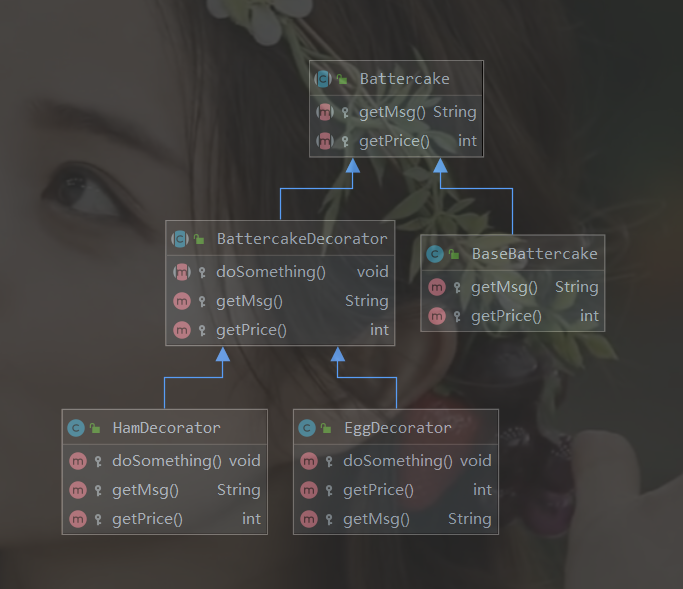

### 1、装饰者模式的应用场景

装饰者模式（Decorator Pattern）是指在不改变原有对象的基础上，将功能附加到对象上，提供了比继承更有弹性的方案（扩展原有对象的功能）。装饰者模式在生活中的应用也比较多，如给煎饼加鸡蛋、给蛋糕加一些水果、给房子装修等，都是在为对象扩展一些额外的职责。装饰者模式适用于以下场景：

1. 扩展一个类的功能或给一个类添加附加职责
2. 动态给一个对象添加功能，这些功能可以再动态地撤销

### 2、装饰模式的代码实现

来看这样一个场景。我们在路边摊买煎饼，不同人有不同的需求。卖煎饼的大姐可以按照你的喜好，给你的煎饼加鸡蛋火腿，也可以给你原味煎饼。我们用代码来还原一下。

首先创建一个煎饼抽象类

```java
public abstract class Battercake {

    protected abstract String getMsg();
    protected abstract int getPrice();
}
```

再创建一个原味煎饼类

```java
public class BaseBattercake extends Battercake{
    @Override
    protected String getMsg() {
        return "原味煎饼";
    }

    @Override
    protected int getPrice() {
        return 5;
    }
}
```

再创建一个扩展套餐的抽象装饰者类（可有可无），具体根据业务模型来选择

```java
public abstract class BattercakeDecorator extends Battercake {

    private Battercake battercake;

    public BattercakeDecorator(Battercake battercake) {
        this.battercake = battercake;
    }

    protected abstract void doSomething();

    @Override
    protected String getMsg() {
        return this.battercake.getMsg();
    }

    @Override
    protected int getPrice() {
        return this.battercake.getPrice();
    }
}
```

接下来，创建鸡蛋装饰类

```java
public class EggDecorator extends BattercakeDecorator{

    public EggDecorator(Battercake battercake) {
        super(battercake);
    }

    @Override
    protected void doSomething() {

    }

    @Override
    protected int getPrice() {
        return super.getPrice() + 2;
    }
    @Override
    protected String getMsg() {
        return super.getMsg() + "+1个鸡蛋";
    }
}
```

最后，创建火腿装饰类

```java
public class HamDecorator extends BattercakeDecorator{
    public HamDecorator(Battercake battercake) {
        super(battercake);
    }

    @Override
    protected void doSomething() {

    }

    @Override
    protected String getMsg() {
        return super.getMsg() + "+1条火腿";
    }

    @Override
    protected int getPrice() {
        return super.getPrice() + 2;
    }
}
```

测试代码如下：

```java
 public static void main(String[] args) {
        //路边摊买个煎饼
        Battercake battercake = new BaseBattercake();
        //加个鸡蛋
        battercake = new EggDecorator(battercake);
        //再加个火腿
        battercake = new HamDecorator(battercake);

        //跟静态代理最大的区别就是职责不同
        //静态代理不一定满足 is-a 的关系
        //静态代理会做功能增强，使同一个职责变得不一样

        //装饰者模式会更多考虑扩展
        System.out.println(battercake.getMsg() + ",总价：" + battercake.getPrice());
    }
```

类图如下：



**装饰者模式最本质的特征是将原有类的附加功能抽离出来，简化原有类的逻辑。**

### 3、装饰者模式和适配器模式对比

|      | 装饰者模式                                                   | 适配器模式                                                   |
| ---- | ------------------------------------------------------------ | ------------------------------------------------------------ |
| 形式 | 是一种非常特别的适配器模式                                   | 没有层级关系，装饰者模式有层级关系                           |
| 定义 | 装饰者和被装饰者实现同一个接口，主要目的的扩展之后依旧保留OOP关系 | 适配器和被适配器没有必然的联系，通常采用继承或代理的形式进行包装 |
| 关系 | 满足`is-a`的关系                                             | 满足`has-a`关系                                              |
| 功能 | 注意覆盖、扩展                                               | 注意兼容、转换                                               |
| 设计 | 前置考虑                                                     | 后置考虑                                                     |

### 4、装饰者模式的优缺点

**优点**

1. 装饰者模式是继承的有力补充，且比继承灵活，可以在不改变原有对象的情况下动态地给一个对象扩展功能，即插即用
2. 使用不同的装饰类及这些装饰类的排序组合，可以实现不同的效果
3. 装饰者模式完全符合开闭原则

**缺点**

1. 会出现更多的代码、更多的类，增加程序的复杂性
2. 动态装饰时，多层装饰会更复杂

