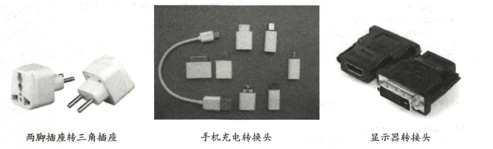

### 1、适配器模式的应用场景

适配器模式（Adapter Pattern）是指将一个类的接口转换成用户期望的另一个接口，使原本接口不兼容的类可以一起工作，适用于以下几种业务场景：

1. 已经存在的类的方法和需求不匹配（方法结果相同或相似）的情况
2. 适配器模式不是软件初始阶段考虑的设计模式，是随着软件发展，由于不同产品、不同厂家造成功能类似而接口不同的问题的解决方案，有点亡羊补牢的感觉

生活中也有类似的应用场景，例如电源插头转换头，手机充电转换头，显示器转接头。

### 3、适配器模式的优缺点

**优点**

1. 能提高类的透明性和复用性，现有的类会被复用但不需要改变
2. 目标类的适配器类解耦，可以提高程序扩展性
3. 在很多业务场景中符合开闭原则

**缺点：**

1. 在适配器代码编写过程中需要进行全面考虑，可能会增加系统的负责性
2. 增加了代码的阅读难度，降低了代码的可读性，过多使用适配器会使系统的代码变得凌乱